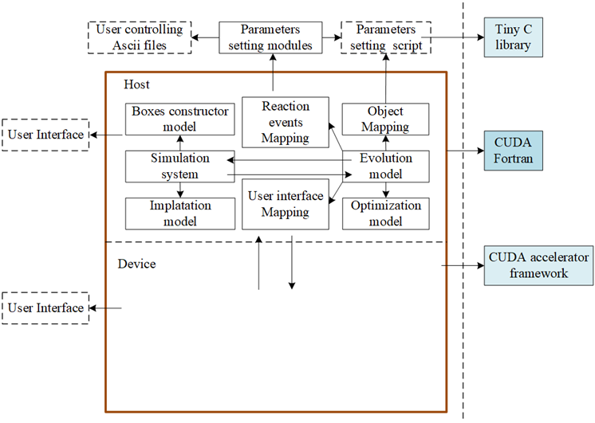

# Introdutions
## 1 Software Introduction

MCPSCU (Monte Carlo package for Sichuan University) is a GPU (Graphics Processing Unit) parallelized migration–coalescence kinetic Monte Carlo simulation package.

MCPSCU was jointly developed by graduate student Lei Zhai and researcher Qing Hou from the Radiation Physics and Medical Physics Research Group, Institute of Nuclear Science and Technology, Sichuan University, starting from 2017. It is mainly applied to the simulation of the migration–coalescence evolution of diffusing objects (such as impurities and defects) in materials. Up to now, MCPSCU has undergone multiple iterations and version upgrades. Through continuous studies of the physical processes involved in the MCPSCU program, several efficient computational strategies proposed by the developers have been incorporated, resulting in a complete high-performance computational package. Currently, MCPSCU has been successfully applied by researchers to simulate the evolution of helium bubbles, displacement defects, and defect clusters in materials.

Figure 1.1 Structural framework diagram of the MCPSCU program.

MCPSCU is mainly developed using Fortran 95/2003. According to the characteristics of the Fortran 95/2003 language, MCPSCU adopts an object-oriented programming approach. A multi-level compilation dependency structure consisting of programs, libraries, and modules is used to achieve a well-organized program architecture.

To enable GPU parallelization, MCPSCU uses the CUDA Fortran parallel programming framework provided by PGI to implement kernel drivers, parallel kernel business logic, multi-thread organization, and multi-thread scheduling. In addition, to facilitate user-defined properties of diffusing objects and reaction events, MCPSCU uses Tiny C as a dynamic scripting interface for user interaction. Figure 1.1 shows the structural framework of the MCPSCU program.

MCPSCU has undergone multiple stages of development. Around 2008, researchers Qing Hou, Yulu Zhou, Chaoqiong Ma, Renshun Li, and others verified the feasibility of using migration–coalescence kinetic Monte Carlo methods to simulate helium bubble growth in materials and developed a simple CPU serial demo program. Since 2017, graduate student Lei Zhai and researcher Qing Hou have completely redeveloped MCPSCU to achieve systematic, object-oriented, extensible, hierarchical, and parallel development. Through multiple functional upgrades and version iterations, MCPSCU has evolved into a highly stable software package capable of high-concurrency operation, mainly under Linux environments.

### 1.1 Version history of MCPSCU
| Version           | Event                                                                                                                                                                                                                                                                                                                                                |
| ----------------- | ---------------------------------------------------------------------------------------------------------------------------------------------------------------------------------------------------------------------------------------------------------------------------------------------------------------------------------------------------- |
| mcpscu_Origin     | A simple CPU serial demo program                                                                                                                                                                                                                                                                                                                     |
| mcpscu_v_xxx      | Complete program reconstruction, initiating object-oriented, extensible, hierarchical, and parallel development                                                                                                                                                                                                                                      |
| **Version**       | **Event**                                                                                                                                                                                                                                                                                                                                            |
| mcpscu_2017_09_30 | Reconstructed the program and implemented GPU parallelization for neighbor list calculation                                                                                                                                                                                                                                                          |
| mcpscu_2017_10_12 | Implemented parallel migration calculations of diffusors on the GPU side                                                                                                                                                                                                                                                                             |
| mcpscu_2017_10_29 | Generated the GPU-side coalescence list before coalescence events                                                                                                                                                                                                                                                                                    |
| mcpscu_2017_11_09 | Proposed using the nearest neighbor list instead of the cut-off range neighbor list                                                                                                                                                                                                                                                                  |
| mcpscu_2017_11_12 | Implemented the GPU-side neighbor list generator                                                                                                                                                                                                                                                                                                     |
| mcpscu_2017_11_22 | Completed diffusor coalescence operations on the GPU side                                                                                                                                                                                                                                                                                            |
| mcpscu_2017_12_10 | Implemented the **Multiple-Box in one run** functionality                                                                                                                                                                                                                                                                                            |
| mcpscu_2018_03_21 | Added compilation and execution support under Linux (CentOS) environments                                                                                                                                                                                                                                                                            |
| mcpscu_2018_05_14 | Added continuous implantation functionality                                                                                                                                                                                                                                                                                                          |
| mcpscu_2019_02_15 | Refactored the code and encapsulated all data and methods using an object-oriented approach; added support for grain boundary settings and continuous particle introduction functionality                                                                                                                                                            |
| mcpscu_2019_02_15 | Standardized user input files and control parameters; enabled user-defined defect types and reaction events; completed dynamic mapping between user-defined defect object models and user-defined reaction event models on both CPU and GPU platforms                                                                                                |
| mcpscu_2019_02_16 | Divided program memory into three ranges: **virtual range**, **expand range**, and **used range**, improving dynamic memory expansion capability                                                                                                                                                                                                     |
| mcpscu_2019_02_20 | Added support for running the program under the CYGWIN environment                                                                                                                                                                                                                                                                                   |
| mcpscu_2019_03_20 | Added multiple offline analysis and statistical functions                                                                                                                                                                                                                                                                                            |
| mcpscu_2021_07_02 | Added the capability to parse molecular dynamics input configurations, enabling analysis and construction of initial defect configurations through multiple approaches; enabled parsing and reading of user-defined multi-batch diffusor configuration folders, including storage of imported information and dynamic invocation during implantation |
Note: Version control is based on the GitLab local server and Git distributed version control system.

## 2 Software Installation Guide

### 2.1 操作系统/软件/硬件环境要求

MCPSCU软件从版本mcpscu_2017_09_30至mcpscu_2018_03_20，支持Windows系统下的运行，从mcpscu_2018_05_14至最新版本，逐渐迁移至Linux以及类Linux环境下的开发。对于最新的mcpscu_2021_07_02版本，目前支持Linux以及基于CYGWIN环境的Windows两种操作环境下的编译、运行。

#### 2.1.1 Linux操作系统

要在Linux操作系统下进行编译、运行MCPSCU，所需软件和硬件如下表所示。说明：安装PGI
CE
Linux时，其会询问是否安装CUDA。这儿建议将CUDA与PGI分开安装。查阅PGI官网确定适配的CUDA版本，先独立安装CUDA，再独立安装PGI，安装PGI时选择不安装CUDA。

由于MCPSCU通过静态调用方式来使用TinyC，因此需要TinyC编译生成静态库。因此，需要在编译生成TinyC之前，使用：

./configure --enable-static选项。

然后再执行make命令。这样才会生成静态库libtcc.lib。

Table 2.1

Linux编译、运行MCPSCU环境需求。

#### 2.1.2 Windows操作系统

要在Windows操作系统下进行编译、运行MCPSCU，所需软件和硬件如下表所示。说明：安装PGI
CE
Win时，其会询问是否安装CUDA。这儿建议将CUDA与PGI分开安装。查阅PGI官网以确定适配的CUDA版本，先独立安装CUDA，再独立安装PGI，安装PGI时选择不安装CUDA。

特别需要注意的是，为了使MCPSCU正常使用，安装PGI CE
Win时需要用勾选并安装Cygwin环境，完成后，双击快捷图标：可以进入Cygwin环境。

此外，由于MCPSCU中需要使用TinyC，因此需要安装TinyC。由于安装PGI CE
Win时已经要求安装Microsoft Visual Studio 2017(C++)，因此，打开"VS 2017
的开发者命令提示符"(位于开始菜单-\>Visual studio
2017)，使用命令进入解压后的TinyC路径PathTinyC
(例如：/xxx/tcc-0.9.27)，执行如下操作：

编译完成后，/xxx/tcc-0.9.27/win32目录下应该包含如下文件：

Table 2.2

Windows编译、运行MCPSCU环境需求。

### 2.2 安装步骤

#### 2.2.1 Linux操作系统

##### 2.2.1.1安装准备

在安装之前，需要预先安装Table
2.1中所示的所有依赖环境。其中所有环境的安装请参照相应的安装文档。在安装完成所有依赖环境后，需要进行以下一些操作。

1、在安装完成CUDA后，用户需要确定CUDA版本以及GPU计算能力，最简单的方法就是利用CUDA自带的Sample中的工具deviceQuery来确定。确定CUDA安装目录CUDAInstallPath(例如
/usr/local/cuda),执行如下命令：

编译deviceQuery程序：

当成功生成deviceQuery可执行文件后，执行：

预期产生如下输出(以NVIDIA Tesla V100为例)：

从输出结果可以看出，CUDA Driver版本为CD=10.1，而GPU计算能力为CC=7.0。

2、在安装完成Tiny C之后，需要确定其安装路径，记为PathTinyC
(例如：/home/xxx/tcc-0.9.27)。

3、在安装完成PGI CE Linux之后，需要确定其安装路径，记为PathPGI
(例如：/opt/pgi)。

##### 2.2.1.2正式安装

然后解压安装程序包，以mcpscu_2021_07_02.tar为例，运行如下命令：

此时文件夹pathToInstall中的结构如下：

将mcpscu_2021_07_02.tar进行解压：

此时对应输出为：

解压后的文件夹中的文件目录应该如下：

根据TinyC的安装位置，修改mcinstall中TINYCCPATH值，具体做法为：使用文本编辑器(例如vim或者gedit)打开mcinstall：

按下"i"键进行编辑，修改如下内容为

其中PathTinyC为用户安装TinyC的目录，例如/home/xxx/tcc-0.9.27。

然后按下"：wq"保存并退出。

观察，如果此时mcinstall文件状态为非可执行，需要执行以下命令将其修改为可执行状态：

执行安装文件：

得到如下安装提示信息：

根据之前CUDA安装版本，以及计算能力，如果与默认值(CD=8.0,
CC=35)不匹配，那么，输入y,回车，将会看到：

此时根据之前得到的CUDA版本，CD=xx.x(例如10.1)，则输入xx.x(例如10.1)
，回车。得到如下结果：

此时根据之前得到的GPU计算能力，CC=x.x(例如7.0)，则输入7.0，回车。得到如下结果：

如果不希望将如上变量值写入用户环境变量中(即\~/.bashrc文件中)，那么输入n，回车；(不会影响后续安装运行)

如果决定将如上的变量值写入用户环境变量中(即~/.bashrc文件中)，那么输入y，回车，这样可以提高再次安装程序时的便捷性。这时程序将在用户的环境变量中(即~/.bashrc文件中)产生如下语句：

输入y/n之后，产生如下结果：

根据之前PGI CE
Linux安装路径PathPGI(例如/opt/pgi)，判断与默认值/opt/pgi是否相符，如果相符，则输入n，回车；

如果不相符，则输入y，回车，得到如下输出结果：

输入PathPGI(例如/opt/pgi)，回车：

根据当前安装PGI CE
Linux版本，决定是否重设PGI版本信息，假设当前PGI版本不为17.4，为19.10，则输入y，回车，得到如下输出结果：

输入当前PGI版本，例如19.10，回车，得到如下结果：

如果不希望将如上变量值写入用户环境变量中(即\~/.bashrc文件中)，那么输入n，回车；(不会影响后续安装运行)

如果决定将如上的变量值写入用户环境变量中(即~/.bashrc文件中)，那么输入y，回车，这样可以提高再次安装程序时的便捷性。这时程序将在用户的环境变量中(即~/.bashrc文件中)产生如下语句：

此时，MCPSCU安装完成，将以出现以下内容：

安装完成后，安装目录下生成文件如下：

其中mcanaly和mcapps分别表示两个指向pathToInstall/mcpscu_2021_07_02/MCLIB/sor/ANALYTOOLS和pathToInstall/mcpscu_2021_07_02/MCLIB/sor/APPLICATIONS的软链接。其中包含各种application的主程序。

mcworkspace则为一个文件夹，其中将包含被编译的各种中间文件、打包的库文件，以及链接生成的application可执行程序。

##### 2.2.1.3编译库文件

在完成上述安装操作后，需要编译库文件。进入MCPSCU安装目录：

执行编译命令：

这里\[options\]可以选用如下选项：

假设这里使用默认选项(即创建Release版本库)，执行编译，当出现如下信息则表示编译成功：

编译成功后，在mcworkspace文件夹中，应该生成如下文件夹：

其中LIB文件夹用于存放Release以及Debug版本程序编译的静态库文件。Release版本编译后会生成Release文件夹，Debug版本编译后会生成Debug文件夹。举例来说，Release文件夹中应生成如下库文件：

##### 2.2.1.4编译、链接应用

库文件编译完成后，用户需要根据自身的需求来编译、链接生成应用。MCPSCU中将应用分为两个部分：APPLICATIONS以及ANALYTOOLS。

APPLICATIONS中包含如下文件：

举例来说，若想编译、链接MigrationCoalescence_GPU应用，则进行如下操作：

这里的\[options\]选项应该与调用mcbdlib所使用的\[options\]选项一致。即可选-d，-r(default)，-dc，-rc,
-c。

回车，执行完成之后，在mcworkspace中将新生成APPLICATIONS文件夹，如果之前选择生成Release版本的程序，那么将会在mcworkspace/mcpscu_2021_07_02/APPLICATIONS/Release文件夹下生成可执行程序MigrationCoalescence_GPU.exe。

同理，若想编译、链接MC_GenerateCascadeBox应用，则进行如下操作：

如果之前选择生成Release版本的程序，那么将会生成在mcworkspace/mcpscu_2021_07_02/APPLICATIONS/Release文件夹下生成可执行程序MC_GenerateCascadeBox.exe。

具体每种应用的功能，将在本手册后续内容中进行介绍。

ANALYTOOLS中包含如下文件：

举例来说，若想编译、链接MC_HomogenizeBox工具，则进行如下操作：

这里的\[options\]选项应该与调用mcbdlib所使用的\[options\]选项一致。即可选-d，-r(default)，-dc，-rc,
-c。

回车，执行完成之后，在mcworkspace中将新生成ANALYTOOLS文件夹，如果之前选择生成Release版本的程序，那么将会在mcworkspace/mcpscu_2021_07_02/ANALYTOOLS/Release文件夹下生成可执行程序MC_HomogenizeBox.exe。

同理，若想编译、链接MC_StatisticClusters_Offline工具，则进行如下操作：

如果之前选择生成Release版本的程序，那么将会生成在mcworkspace/mcpscu_2021_07_02/ANALYTOOLS/Release文件夹下生成可执行程序MC_StatisticClusters_Offline.exe。

具体每种工具的功能，将在本手册后续内容中进行介绍。

#### 2.2.2 Windows操作系统

##### 2.2.2.1安装准备

在安装之前，需要预先安装Table
2.2中所示的所有依赖环境。其中所有环境的安装请参照相应的安装文档。在安装完成所有依赖环境后，需要进行以下一些操作。

特别需要注意的是，为了使MCPSCU正常使用，安装PGI CE
Win时需要用勾选并安装Cygwin环境。

1、在安装完成CUDA后，用户需要确定CUDA版本以及GPU计算能力，最简单的方法就是利用CUDA自带的工具deviceQuery来确定。确定CUDA安装目录CUDAInstallPath(例如C:`\Program `{=tex}Files`\NVIDIA `{=tex}GPU
Computing
Toolkit`\CUDA`{=tex}`\v1`{=tex}0.1`\extras`{=tex}`\demo`{=tex}\_suite)，进入windows
CMD (Command
Prompt)中，执行如下命令(以安装路径CUDAInstallPath为C:`\Program `{=tex}Files`\NVIDIA `{=tex}GPU
Computing
Toolkit`\CUDA`{=tex}`\v1`{=tex}0.1`\extras`{=tex}`\demo`{=tex}\_suite为例)：

执行deviceQuery.exe：

回车，预期产生如下输出(以NVIDIA GeForce GTX 1660 SUPER为例)：

从输出结果可以看出，CUDA Driver版本为CD=10.1，而GPU计算能力为CC=7.5。

2、双击快捷图标：可以进入Cygwin环境，如果PGI
提供的Cygwin环境的路径为/cygdrive/c/xxx类型，需要修改/etc/fstab中的内容：

按下"i"键进行编辑，将其中的"none /cygdrive cygdrive binary,posix=0,user
0 0"修改为：

none / cygdrive binary,posix=0,user 0 0

然后按下"：wq"保存并退出。

3、在安装完成Tiny C之后，需要确定其安装路径，记为PathTinyC
(例如：/xxx/tcc-0.9.27)。

4、在安装完成PGI CE Linux之后，需要确定其安装路径，记为PathPGI
(例如：C:`\PROGRA`{=tex}~1`\PGI`{=tex}，其中PROGRA~1表示"Program
Files")。

##### 2.2.2.2正式安装

双击快捷图标：进入Cygwin环境，然后解压安装程序包，以mcpscu_2021_07_02.tar为例，运行如下命令：

此时文件夹pathToInstall中的结构如下：

将mcpscu_2021_07_02.tar进行解压：

此时对应输出为：

解压后的文件夹中的文件目录应该如下：

根据TinyC的安装位置，修改mcinstall中TINYCCPATH值，具体做法为：使用文本编辑器(例如vim或者gedit)打开mcinstall：

按下"i"键进行编辑，修改如下内容为

其中PathTinyC为用户安装TinyC的目录，例如/home/xxx/tcc-0.9.27。

然后按下"：wq"保存并退出。

观察，如果此时mcinstall文件状态为非可执行，需要执行以下命令将其修改为可执行状态：

执行安装文件：

得到如下安装提示信息：

根据之前CUDA安装版本，以及计算能力，如果与默认值(CD=8.0,
CC=35)不匹配，那么，输入y,回车，将会看到：

此时根据之前得到的CUDA版本，CD=xx.x(例如10.1)，则输入xx.x(例如10.1)
，回车。得到如下结果：

此时根据之前得到的GPU计算能力，CC=x.x(例如7.5)，则输入7.5，回车。得到如下结果：

如果不希望将如上变量值写入用户环境变量中(即\~/.bashrc文件中)，那么输入n，回车；(不会影响后续安装运行)

如果决定将如上的变量值写入用户环境变量中(即~/.bashrc文件中)，那么输入y，回车，这样可以提高再次安装程序时的便捷性。这时程序将在用户的环境变量中(即~/.bashrc文件中)产生如下语句：

输入y/n之后，产生如下结果：

根据之前PGI CE
Win安装路径PathPGI(例如C:`\PROGRA`{=tex}~1`\PGI`{=tex})，判断与默认值C:`\PROGRA`{=tex}~1`\PGI是否相符`{=tex}，如果相符，则输入n，回车；

如果不相符，则输入y，回车，得到如下输出结果：

输入PathPGI(例如C:`\PROGRA`{=tex}\~1`\PGI`{=tex})，回车：

根据当前安装PGI CE
Win版本，决定是否重设PGI版本信息，假设当前PGI版本不为17.4，为19.10，则输入y，回车，得到如下输出结果：

输入当前PGI版本，例如19.10，回车，得到如下结果：

如果不希望将如上变量值写入用户环境变量中(即\~/.bashrc文件中)，那么输入n，回车；(不会影响后续安装运行)

如果决定将如上的变量值写入用户环境变量中(即~/.bashrc文件中)，那么输入y，回车，这样可以提高再次安装程序时的便捷性。这时程序将在用户的环境变量中(即~/.bashrc文件中)产生如下语句：

此时，MCPSCU安装完成，将以出现以下内容：

安装完成后，安装目录下生成文件如下：

其中mcanaly和mcapps分别表示两个指向pathToInstall/mcpscu_2021_07_02/MCLIB/sor/ANALYTOOLS和pathToInstall/mcpscu_2021_07_02/MCLIB/sor/APPLICATIONS的软链接。其中包含各种application的主程序。

mcworkspace则为一个文件夹，其中将包含被编译的各种中间文件、打包的库文件，以及链接生成的application可执行程序。

##### 2.2.2.3编译库文件

在完成上述安装操作后，需要编译库文件。双击快捷图标：进入Cygwin环境，进入MCPSCU安装目录：

执行编译命令：

这里\[options\]可以选用如下选项：

若出现错误"pgfortran-Error-LLVM code generator
'C:`\PROGRA`{=tex}\~1`\PGI`{=tex}/linux86-64-nollvm/19.10/' is not
available in this installation"，则需要进行如下修复：

打开PGI安装路径如C:`\PROGRA`{=tex}~1`\PGI`{=tex}，进入C:`\PROGRA`{=tex}~1`\PGI`{=tex}`\win64`{=tex}\\19.10`\bin目录中`{=tex}，修改"nativerc"文件，将其中所有"linux86-64-nollvm"改为"win64"。

假设这里使用默认选项(即创建Release版本库)，执行编译，当出现如下信息则表示编译成功：

编译成功后，在mcworkspace文件夹中，应该生成如下文件夹：

其中LIB文件夹用于存放Release以及Debug版本程序编译的静态库文件。Release版本编译后会生成Release文件夹，Debug版本编译后会生成Debug文件夹。举例来说，Release文件夹中应生成如下库文件：

##### 2.2.2.4编译、链接应用

库文件编译完成后，用户需要根据自身的需求来编译、链接生成应用。MCPSCU中将应用分为两个部分：APPLICATIONS以及ANALYTOOLS。

APPLICATIONS中包含如下文件：

举例来说，若想编译、链接MigrationCoalescence_GPU应用，则进行如下操作：

这里的\[options\]选项应该与调用mcbdlib所使用的\[options\]选项一致。即可选-d，-r(default)，-dc，-rc,
-c。

回车，执行完成之后，在mcworkspace中将新生成APPLICATIONS文件夹，如果之前选择生成Release版本的程序，那么将会在mcworkspace/mcpscu_2021_07_02/APPLICATIONS/Release文件夹下生成可执行程序MigrationCoalescence_GPU.exe。

同理，若想编译、链接MC_GenerateCascadeBox应用，则进行如下操作：

如果之前选择生成Release版本的程序，那么将会生成在mcworkspace/mcpscu_2021_07_02/APPLICATIONS/Release文件夹下生成可执行程序MC_GenerateCascadeBox.exe。

具体每种应用的功能，将在本手册后续内容中进行介绍。

ANALYTOOLS中包含如下文件：

举例来说，若想编译、链接MC_HomogenizeBox工具，则进行如下操作：

这里的\[options\]选项应该与调用mcbdlib所使用的\[options\]选项一致。即可选-d，-r(default)，-dc，-rc,
-c。

回车，执行完成之后，在mcworkspace中将新生成ANALYTOOLS文件夹，如果之前选择生成Release版本的程序，那么将会在mcworkspace/mcpscu_2021_07_02/ANALYTOOLS/Release文件夹下生成可执行程序MC_HomogenizeBox.exe。

同理，若想编译、链接MC_StatisticClusters_Offline工具，则进行如下操作：

如果之前选择生成Release版本的程序，那么将会生成在mcworkspace/mcpscu_2021_07_02/ANALYTOOLS/Release文件夹下生成可执行程序MC_StatisticClusters_Offline.exe。

具体每种工具的功能，将在本手册后续内容中进行介绍。

## 3 Physical Model Description

MCPSCU用于模拟材料中对象的迁移-融合问题，其依赖于随机行走理论。随机行走的具体细节可以参见文献\[5\]。其基本物理过程可以由下图(Fig
2.1)描述：

Fig 2.1

MCPSCU中扩散体迁移-融合演化示意图。

如Fig
2.1所示，为MCPSCU中扩散体迁移-融合演化示意图。可以看到，扩散体在基体(MCPSCU模拟盒子)中作随机扩散运动，当扩散体之间的距离小于两两反应距离时，相应的扩散体之间会发生融合反应。

扩散体在基体中的随机扩散过程可以用随机行走理论来描述。在MCPSCU中，假设每一步时间步长为，那么在这一步内每个扩散体行走距离由如下的Einstein公式决定：

(2.1)

其中表示扩散体的扩散系数，用户可以通过MCPSCU中的用户控制文件来设定相应的值(详见下面关于用户输入文件-盒子定义文件的描述)。而由MCPSCU中所提供的一系列时间步长控制算法所决定，用户同样可以通过MCPSCU中的用户控制文件来选取相应的算法并设定相应的参数(详见下面关于用户输入文件-控制文件的描述)。

扩散体与扩散体之间的反应距离同样可以通过MCPSCU中的用户控制文件来设定相应的值(详见下面关于用户输入文件-盒子定义文件的描述)，除此之外，MCPSCU中还提供了扩散体-扩散体之间反应行为、反应产物的控制方法，具体见下面章节关于下面关于用户输入文件-盒子定义文件的描述。

## 4 Model Parameter Settings

如Fig
1.1所示，MCPSCU中模型参数的设置依赖于两种模式：Ascii形式的主控文件群以及接口程序修改功能。其中Ascii文件内部可以嵌套Tiny
C形式的输入参数控制脚本。文件间的组织形式如下：

Fig 2.2

MCPSCU中用户控制文件组织形式。

Ascii形式的主控文件群包括：流程控制文件(Flow control
file)、模拟系统及参数文件(Simulation system parameter
file)、模拟系统初始化文件(Simulation system initial
file)、外部对象引入文件(External objects implanting file)。接口程序(User
defined model/data
interface)主要用于一些复杂数学函数式的输入。下面将对上述文件、接口进行详细的介绍。

### 4.1主控文件群

#### 4.1.1 主控文件(Main control file)

主控文件(Main control
file)用于组织主控文件群中的所有文件，其也是MCPSCU运行时第一个读入的文件。对第二章2.2.1.4节和2.2.2.4节所编译、链接形成的MCPSCU应用xxx.exe，一般在运行时通过命令参数来指定主控文件(例如SampleSetup.dat)的路径，程序运行参数输入形式一般如下(Linux)：

其中PathForApplication为MCPSCU应用程序的目录，例如SomePath/mcworkspace/APPLICATIONS/Release。\[options\]为其他运行参数，将在第五节进行介绍。

主控文件的写法如下：

或者：

其中
"!"表示注释符号，"!"符号后面所有的内容都会被略去。"&"表示具有意义的控制行的开始。

MCPSCU中一般具有组合意义的参数按照"节"的形式来组织，以主控文件为例，其中包含了一个以"&START\_\[MethodFactory\]"或"&RESTART\_\[MethodFactory\]"为开始限定符，以"&END"为结尾限定符的一个"节"。MCPSCU要求在编写所有Ascii形式的控制文件时，所有的节必须定义完整的开始和结束限定符。

"&START\_\[MethodFactory\]"和"&RESTART\_\[MethodFactory\]"限定符的区别在于，"&START\_\[MethodFactory\]"限定符将使得MCPSCU程序从"&INIF"限定符所指定的文件中初始化模拟系统，且MCPSCU中所有记录型变量如时间、步数、随机数等都会被设置为从默认值开始。而"&RESTART\_\[MethodFactory\]"限定符将使得MCPSCU程序从"&RESTARTF"限定符所指定的文件中引入先前保存的模拟系统镜像，且MCPSCU中所有记录型变量如时间、步数、随机数等都会从"&RESTARTF"限定符所指定的文件中提取。

而\[MethodFactory\]指使用哪种模式来进行模拟，目前程序中包含了"MIGCOALE_CLUSTER_GPU"、"MIGCOALE_CLUSTER_CPU"、"CalCapture_GPU"(开发中)三种模式。关于这三种选项的具体意义，将在第6章进行描述。

下面将描述主控文件中"&START\_\[MethodFactory\]"或"&RESTART\_\[MethodFactory\]"所定义"节"中所包含的各个子限定符的具体意义。

##### &CTLF

用于标识流程控制文件(Flow control file)的路径。

##### &BOXF

用于标识模拟系统及参数文件(Simulation system parameter file)的路径。

##### &INIF

用于标识模拟系统初始化文件(Simulation system initial file)的路径。

##### &RESTARTF

用于标识模拟系统重启所需系统镜像文件的路径。

##### &IMPF

用于标识模拟系统外部注入文件。

##### &COUT

用于标识模拟系统输出文件夹位置。

#### 4.1.2 流程控制文件(Flow control file)

在介绍流程控制文件之前，需要介绍MCPSCU程序中几个概念。系统运行流程如Fig
2.3所示。从Fig
2.3可以看出MCPSCU运行时"步(Step)"、"节(Section)"、"测试(Test/Job)"、"执行(Execution)"之间的关系。一个"执行(Execution)"中顺序执行多个"测试(Test/Job)"。一个"测试(Test/Job)"中顺序执行多个"节(Section)"，而一个"节(Section)"中则会执行大量的"步(Step)"。

流程控制文件用于控制测试(Test/Job)中各个节(Section)的执行。

Fig 2.3

MCPSCU运行时"步(Step)"、"节(Section)"、"测试(Test/Job)"之间的关系。(a)表示系统各个test/Job之间相互独立(&Box中##3参数设为1)。(b)表示系统各个test/Job之间相互依赖(&Box中##3参数设为0)。

流程控制文件由主控文件中的"&CTLF"限定符所指定开始，由"&ENDCTLF"限定符所指定结束，其用于设置MCPSCU模拟过程中的流程控制和体系参数控制。其基本结构如下：

其中包含了"&COMMSUBCTL"、"&ANALYSUBCTL"以及多个"&SECTSUBCTL"节为开始的"节"，每个"节"以"&ENDSUBCTL"为结束。下面将对流程控制文件中的各个"节"进行介绍。

##### &COMMSUBCTL

"&COMMSUBCTL"节用于设置模拟中所使用的共同的控制参数，其基本组成结构如下：

COMMSUBCTL节由"&COMMSUBCTL"限定符开始，由"&ENDSUBCTL"限定符结束，其中所包含的多个参数(集)设置描述如下：

###### &BOX

参数##3设置为1或0时，系统运行流程如Fig 2.3所示。从Fig
2.3可以看出MCPSCU运行时"步(Step)"、"节(Section)"、"测试(Test/Job)"、"执行(Execution)"之间的关系。"&Box"中可以通过##3参数来指定一次程序"执行(Execution)"期间，"测试(Test/Job)"与"测试(Test/Job)"之间的依赖关系。总的来说，##3参数为1时，"测试(Test/Job)"之间相互独立，而##3参数为0时，后续"测试(Test/Job)"依赖前面已进行"测试(Test/Job)"的结果，后续"测试(Test/Job)"在前面"测试(Test/Job)"结果上继续演化。除此之外，可以看出，一个"测试(Test/Job)"中顺序执行多个"节(Section)"，而一个"节(Section)"中则会执行大量的"步(Step)"。

参数##1表示单次Test/Job中独立运行盒子数目，而参数##1表示系统一次执行(Execution)总共需要运行盒子总数目。需要设置##2为##1的整数倍。如Fig
2.4所示，每个Test/Job中，系统将独立运行##1个盒子，假设NR=##1/##2，那么NR次Test/Job后，程序将处理完所有的盒子。但是当##3参数为0时，前后相邻test/Job之间不独立，即第i个盒子在第r个test/Job的运行结果将作为第r+1个test中第i+##1个盒子的初始化构型。当##3参数为1时，前后相邻test/Job之间的盒子完全独立，即第r个test的所有盒子和第r+1个test/Job中的所有盒子之间毫无关联。

Fig 2.4

MCPSCU运行时，不同"测试(Test/Job)"之间模拟盒子的组织形式。表示系统各个test/Job之间相互独立(&Box中##3参数设为1)。(b)表示系统各个test/Job之间相互依赖(&Box中##3参数设为0)。

###### &RANDSEED

##### &ANALYSUBCTL

MCPSCU中，输出构型文件名称格式为：

MCPSCU中离线分析程序主要通过读取这些构型文件从而来提取、分析需要的信息。"&ANALYSUBCTL"节用于设置分析过程中所使用控制参数，其基本组成结构如下：

ANALYSUBCTL节由"&
ANALYSUBCTL"限定符开始，由"&ENDSUBCTL"限定符结束，其中所包含的多个参数(集)设置描述如下：

###### &JOBSEL

###### &TSECTIONSEL

###### &CFGSEL

###### &BOXSEL

##### &SECTSUBCTL

从Fig
2.3可以看出，一个Job/test包含了多个"节(Section)"。因此流程控制文件中需要详细描述这些"节(Section)"的控制细节。每个"节(Section)"的控制参数集合由"&SECTSUBCTL"开始，由"&ENDSUBCTL"结束，其基本组成如下：

每个&SECTSUBCTL中包含了多个子控制参数集合："&TEMPSUBCTL"、"&BOUNDSUBCTL"、"&NEIGHBSUBCTL"、"&IMPLANTSUBCTL"、"&TIMESUBCTL"、"&MEMORYSUBCTL"、"&ADDONDATA"、"&MODELDATA"。下面将介绍每种参数集合的意义。

###### & TEMPSUBCTL

###### & BOUNDSUBCTL

###### & NEIGHBSUBCTL

###### & IMPLANTSUBCTL

###### & IMPLANTSUBCTL

###### & TIMESUBCTL

###### &MEMORYSUBCTL

###### &ADDONDATA

###### &MODELDATA

#### 4.1.3 模拟系统及参数文件(Simulation system parameter file)

#### 4.1.4 模拟系统初始化文件(Simulation system initial file)

#### 4.1.5 外部对象引入文件(External objects implanting file)

### 4.2数据/模型接口

统一了扩散系数的输入输出，将扩散系数输入后统一转为3-D形式的扩散系数大小，然后，统一使用形式，如下图所示：

## 5 Program Runtime Parameters

## 6 Program Operation Modes

## References

\[1\] L. Zhai, C. Ma, J. Cui, Q. Hou, GPU-based acceleration of Monte
Carlo simulations for migration-coalescence evolution of gas bubbles in
materials, Model. Simul. Mater. Sci. Eng. 27 (2019) 055008.
https://doi.org/10.1088/1361-651x/ab1d14.

\[2\] 周宇璐, 李仁顺, 张宝玲, 邓爱红, 侯氢, 材料中He深度分布演化的Monte
Carlo模拟研究, 物理学报. 60 (2011).

\[3\] R.S. Li, Y.L. Zhou, J. Wang, Q. Hou,
材料中氦泡迁移-融合的蒙特卡罗模拟及其参数优化, Nucl. Phys. Rev. (in
Chinese). 29 (2012) 89--91.

\[4\] 李仁顺, 周宇璐, 汪俊, 侯氢,
材料中氦泡迁移-融合的蒙特卡罗模拟及其参数优化, 原子核物理评论. 29 (2012)
89--91.

\[5\] S. Chandrasekhar, Stochastic problems in physics and astronomy,
Rev. Mod. Phys. 15 (1943) 1--89.
https://doi.org/10.1103/RevModPhys.15.1.

\[6\] J.H. Evans, R. Escobar Galindo, A. van Veen, A description of
bubble growth and gas release during thermal annealing of helium
implanted copper, Nucl. Instrum. Methods Phys. Res. Sect. B-Beam
Interact. Mater. Atoms. 217 (2004) 276--280.
https://doi.org/https://doi.org/10.1016/j.nimb.2003.10.013.

\[7\] Q. Hou, Y.L. Zhou, J. Wang, A.H. Deng, Cascade coalescence of
noble gas bubbles in materials, J. Appl. Phys. 107 (2010) 1--6.
https://doi.org/10.1063/1.3354088.

\|---\|

| 关于MCPSCU \|

\|---\|---\|

| mcpscu_Origin \| 简易的CPU串行Demo程序 \|

| mcpscu_v_xxx \|
  完全重构程序，开始面向对象化、可扩展性、多层次化、并行化开发 \|

| 版本 \| 事件 \|

| mcpscu_2017_09_30 \| 重新构建程序，并对邻居列表计算进行GPU并行化 \|

| mcpscu_2017_10_12 \| 于GPU端进行扩散体并行化迁移计算处理 \|

| mcpscu_2017_10_29 \| 在融合事件之前，产生GPU端融合列表 \|

| mcpscu_2017_11_09 \| 提出使用nearest neighbor list代替cut-off range
  neighbor list \|

| mcpscu_2017_11_12 \| 使用GPU端的邻居列表产生器 \|

| mcpscu_2017_11_22 \| 在GPU端完成扩散体融合操作 \|

| mcpscu_2017_12_10 \| 实现Multiple-Box in one run功能 \|

| mcpscu_2018_03_21 \| 将程序添加Linux(Centos)环境下的编译、运行功能 \|

| mcpscu_2018_05_14 \| 增加连续注入功能 \|

| mcpscu_2019_02_15 \|
  对代码进行重构，对所有数据和方法按照面向对象形式的封装，支持晶界设置以及粒子连续引入功能
  \|

| mcpscu_2019_02_15 \|
  将用户输入文件和控制参数进行规范化，并支持用户定义任意类型缺陷和反应事件，完成用户定义缺陷对象类型-模型以及用户定义反应事件-模型间CPU及GPU上的动态映射功能
  \|

| mcpscu_2019_02_16 \| 对程序内存进行三段式划分，形成virtual
  range、expand range以及used range，以提高内存动态扩展能力 \|

| mcpscu_2019_02_20 \| 增加CYGWIN下运行程序的功能 \|

| mcpscu_2019_03_20 \| 增加多种离线分析、统计功能 \|

| mcpscu_2021_07_02 \|
  增加对分子动力学输入构型的解析能力，允许使用多种方式实现初始缺陷构型的分析和构建；允许解析读取用户设置的多批次扩散体构型文件夹，并完成读入信息的存储、注入时动态调用等能力
  \|

\|---\|

|  \|

\|---\|---\|---\|

| 操作系统 \| 最低版本 \| 推荐版本 \|

| Linux \| Red Hat 4.4.7-23 \| Centos 6.9+ \|

\|---\|---\|---\|

| 硬件环境 \| 硬件环境 \| 硬件环境 \|

| 名称 \| 最低配置 \| 推荐配置 \|

| CPU \| Intel(R) Core i3 \| Intel(R) Xeon series \|

| GPU \| NVIDIA Tesla C2050 \| NVIDIA Tesla V100 \|

| 内存 \| 500MB \| 50G+ \|

| 硬盘空间 \| 100MB \| 1TB+ \|

| 软件环境 \| 软件环境 \| 软件环境 \|

| 名称 \| 最低版本 \| 推荐版本 \|

| MCPSCU \| mcpscu_2018_03_21 \| mcpscu_2021_07_02 \|

| GNU Make \| 3.81 \| 3.82 \|

| NVIDIA driver \| 375.26 \| 440.64 \|

| CUDA \| 8.0 \| 10.2 \|

| PGI CE Linux \| 17.4 \| 19.4 \|

| g++ \| 4.47 \| 4.85 \|

| Tiny C \| 0.9.27 \| 0.9.27 \|

| GUN tar \| 1.23 \| 1.26 \|

\|---\|---\|---\|

| 操作系统 \| 最低版本 \| 推荐版本 \|

| Windows \| Windows 7 \| Windows server 2012 \|

\|---\|

| xxx`\tcc-0.9`{=tex}.27\>cd win32 \|

\|---\|

| xxx`\tcc-0.9`{=tex}.27`\win32`{=tex}\> build-tcc.bat -c cl \|

\|---\|

| ├── build-tcc.bat ├── doc │   └── tcc-win32.txt ├── examples │   ├──
  dll.c │   ├── fib.c │   ├── hello_dll.c │   ├── hello_win.c │   └──
  libtcc_test.c ├── i386-win32-tcc.exe ├── i386-win32-tcc.pdb ├──
  include │   ├── \_mingw.h │   ├── assert.h │   ├── conio.h │   ├──
  ctype.h │   ├── dir.h │   ├── direct.h │   ├── dirent.h │   ├── dos.h
  │   ├── errno.h │   ├── excpt.h │   ├── fcntl.h │   ├── fenv.h │   ├──
  float.h │   ├── inttypes.h │   ├── io.h │   ├── limits.h │   ├──
  locale.h │   ├── malloc.h │   ├── math.h │   ├── mem.h │   ├──
  memory.h │   ├── process.h │   ├── sec_api │   │   ├── conio_s.h │  
  │   ├── crtdbg_s.h │   │   ├── io_s.h │   │   ├── mbstring_s.h │   │  
  ├── search_s.h │   │   ├── stdio_s.h │   │   ├── stdlib_s.h │   │  
  ├── stralign_s.h │   │   ├── string_s.h │   │   ├── sys │   │   │  
  └── timeb_s.h │   │   ├── tchar_s.h │   │   ├── time_s.h │   │   └──
  wchar_s.h │   ├── setjmp.h │   ├── share.h │   ├── signal.h │   ├──
  stdarg.h │   ├── stdbool.h │   ├── stddef.h │   ├── stdint.h │   ├──
  stdio.h │   ├── stdlib.h │   ├── string.h │   ├── sys │   │   ├──
  fcntl.h │   │   ├── file.h │   │   ├── locking.h │   │   ├── stat.h
  │   │   ├── time.h │   │   ├── timeb.h │   │   ├── types.h │   │   ├──
  unistd.h │   │   └── utime.h │   ├── tcc │   │   └── tcc_libm.h │  
  ├── tcclib.h │   ├── tchar.h │   ├── time.h │   ├── vadefs.h │   ├──
  values.h │   ├── varargs.h │   ├── wchar.h │   ├── wctype.h │   └──
  winapi │   ├── basetsd.h │   ├── basetyps.h │   ├── guiddef.h │   ├──
  poppack.h │   ├── pshpack1.h │   ├── pshpack2.h │   ├── pshpack4.h │  
  ├── pshpack8.h │   ├── winbase.h │   ├── wincon.h │   ├── windef.h │  
  ├── windows.h │   ├── winerror.h │   ├── wingdi.h │   ├── winnt.h │  
  ├── winreg.h │   ├── winuser.h │   └── winver.h ├── lib │   ├──
  chkstk.S │   ├── crt1.c │   ├── crt1w.c │   ├── dllcrt1.c │   ├──
  dllmain.c │   ├── gdi32.def │   ├── kernel32.def │   ├── libtcc1-32.a
  │   ├── libtcc1-64.a │   ├── msvcrt.def │   ├── user32.def │   ├──
  wincrt1.c │   └── wincrt1w.c ├── libtcc │   ├── libtcc.def │   └──
  libtcc.h ├── libtcc.dll ├── libtcc.exp ├── libtcc.lib ├── libtcc.obj
  ├── libtcc.pdb ├── tcc-win32.txt ├── tcc.exe ├── tcc.obj ├── tcc.pdb
  └── vc140.pdb \|

\|---\|---\|---\|

| 硬件环境 \| 硬件环境 \| 硬件环境 \|

| 名称 \| 最低配置 \| 推荐配置 \|

| CPU \| Intel(R) Core i3 \| Intel(R) Xeon series \|

| GPU \| NVIDIA Tesla C2050 \| NVIDIA Tesla V100 \|

| 内存 \| 500MB \| 50G+ \|

| 硬盘空间 \| 100MB \| 1TB+ \|

| 软件环境 \| 软件环境 \| 软件环境 \|

| 名称 \| 最低版本 \| 推荐版本 \|

| MCPSCU \| mcpscu_2018_03_21 \| mcpscu_2021_07_02 \|

| PGI CE Win (include CYGWIN) \| 17.4 \| 19.10 \|

| NVIDIA driver \| 375.26 \| 440.64 \|

| CUDA \| 8.0 \| 10.1 \|

| CYGWIN (included in PGI CE Win) \| 1.7.27 \| 3.2.0 \|

| g++ \| 4.47 \| 4.85 \|

| Tiny C \| 0.9.27 \| 0.9.27 \|

| GUN tar \| 1.23 \| 1.26 \|

| Microsoft Visual Studio(required by PGI CE Win) \| 2015 \| 2017 \|

\|---\|

| \[xxx@localhost \~\]cd CUDAInstallPath/samples/1_Utilities/deviceQuery
  \|

\|---\|

| \[xxx@localhost \~\]make \|

\|---\|

| \[xxx@localhost \~\]./deviceQuery \|

\|---\|---\|

| Detected 3 CUDA Capable device(s) \| \|

| Device 0: "Tesla V100-PCIE-32GB" \| \|

| CUDA Driver Version / Runtime Version \| 10.1 / 10.0 \|

| CUDA Capability Major/Minor version number: \| 7.0 \|

| Total amount of global memory: \| 32480 MBytes (34058272768 bytes) \|

| (80) Multiprocessors, ( 64) CUDA Cores/MP: \| 5120 CUDA Cores \|

| GPU Max Clock rate: \| 1380 MHz (1.38 GHz) \|

| Memory Clock rate: \| 877 Mhz \|

| Memory Bus Width: \| 4096-bit \|

| L2 Cache Size: \| 6291456 bytes \|

| Maximum Texture Dimension Size (x,y,z) \| 1D=(131072), 2D=(131072,
  65536), 3D=(16384, 16384, 16384) \|

| Maximum Layered 1D Texture Size, (num) layers \| 1D=(32768), 2048
  layers \|

| Maximum Layered 2D Texture Size, (num) layers \| 2D=(32768, 32768),
  2048 layers \|

| Total amount of constant memory: \| 65536 bytes \|

| Total amount of shared memory per block: \| 49152 bytes \|

| Total number of registers available per block: \| 65536 \|

| Warp size: \| 32 \|

| Maximum number of threads per multiprocessor: \| 2048 \|

| Maximum number of threads per block: \| 1024 \|

| Max dimension size of a thread block (x,y,z): \| (1024, 1024, 64) \|

| Max dimension size of a grid size (x,y,z): \| (2147483647, 65535,
  65535) \|

| Maximum memory pitch: \| 2147483647 bytes \|

| Texture alignment: \| 512 bytes \|

| Concurrent copy and kernel execution: \| Yes with 7 copy engine(s) \|

| Run time limit on kernels: \| No \|

| Integrated GPU sharing Host Memory: \| No \|

| Support host page-locked memory mapping: \| Yes \|

| Alignment requirement for Surfaces: \| Yes \|

| Device has ECC support: \| Enabled \|

| Device supports Unified Addressing (UVA): \| Yes \|

| Device supports Compute Preemption: \| Yes \|

| Supports Cooperative Kernel Launch: \| Yes \|

| Supports MultiDevice Co-op Kernel Launch: \| Yes \|

| Device PCI Domain ID / Bus ID / location ID: \| 0 / 24 / 0 \|

\|---\|

| \[xxx@localhost \~\]cp mcpscu_2021_07_02.tar pathToInstall/ \|

\|---\|

| \[xxx@localhost \~\]cd pathToInstall/ \|

\|---\|

| pathToInstall ├── mcpscu_2021_07_02.tar \|

\|---\|

| \[xxx@localhost pathToInstall\]tar -vxf mcpscu_2021_07_02.tar \|

\|---\|

| mcinstall mcpscu_2021_07_02.tar.bz2 MCSample_2021_07_02/
  MCSample_2021_07_02/BatchBox/
  MCSample_2021_07_02/BatchBox/Cascade1Box200LU_NBox800.dat
  MCSample_2021_07_02/BoxFile.dat MCSample_2021_07_02/CascadeBox/
  MCSample_2021_07_02/CascadeBox/CascadeGenerateCtrlFile.dat
  MCSample_2021_07_02/CtrlFile.dat MCSample_2021_07_02/FromMF973K/
  MCSample_2021_07_02/FromMF973K/Config317.dat
  MCSample_2021_07_02/GBDIST.dat MCSample_2021_07_02/ImpF.dat
  MCSample_2021_07_02/ImplantDist.dat MCSample_2021_07_02/IniF.dat
  MCSample_2021_07_02/PANDA/ MCSample_2021_07_02/PANDA/HeW100ev100nm.dat
  MCSample_2021_07_02/PANDAS/
  MCSample_2021_07_02/PANDAS/HeCu100ev100nm.dat
  MCSample_2021_07_02/PANDAS/HeCu10Kev200nm.dat
  MCSample_2021_07_02/PANDAS/HeCu1Kev100nm.dat
  MCSample_2021_07_02/PANDAS/HeW100ev100nm.dat
  MCSample_2021_07_02/PANDAS/HeW10Kev200nm.dat
  MCSample_2021_07_02/PANDAS/HeW1Kev100nm.dat
  MCSample_2021_07_02/SRIM2003/
  MCSample_2021_07_02/SRIM2003/HeCu100ev100nmRANGE_3D.txt
  MCSample_2021_07_02/SampleSetup.dat \|

\|---\|

| pathToInstall ├── mcinstall ├── mcpscu_2021_07_02.tar ├──
  mcpscu_2021_07_02.tar.bz2 └── MCSample_2021_07_02 \|

\|---\|

| \[xxx@localhost pathToInstall\]vim mcinstall \|

\|---\|

| #---- Some Vars that users can modify ----
  TINYCCPATH=\$PWD/tcc-0.9.27/ \|

\|---\|

| #---- Some Vars that users can modify ---- TINYCCPATH= PathTinyC \|

\|---\|

| \[xxx@localhost pathToInstall\]chmod +x mcinstall \|

\|---\|

| \[xxx@localhost pathToInstall\]./mcinstall \|

\|---\|

| mcpscu_2021_07_02/ mcpscu_2021_07_02/TCCLIB/ ... The default CUDA
  version is: cuda8.0 ,the computer capability is: cc35 Reset CUDA
  Version and computer capability (y/n)? \|

\|---\|

| ... The default CUDA version is: cuda8.0 ,the computer capability is:
  cc35 Reset CUDA Version and computer capability (y/n)?y Please input
  the CUDA version (xx.x for instance 9.0 , 10.0) \|

\|---\|

| The default CUDA version is: cuda8.0 ,the computer capability is: cc35
  Reset CUDA Version and computer capability (y/n)?y Please input the
  CUDA version (xx.x for instance 9.0 , 10.0) 10.1 Please input the
  computer capability (x.x for instance 2.x , 3.0 , 7.0) \|

\|---\|

| The default CUDA version is: cuda8.0 ,the computer capability is: cc35
  Reset CUDA Version and computer capability (y/n)?y Please input the
  CUDA version (xx.x for instance 9.0 , 10.0) 10.1 Please input the
  computer capability (x.x for instance 2.x , 3.0 , 7.0)7.0 Set these
  changing to .bashrc file (y/n)? \|

\|---\|

| #---The environment for CUDA Driver--- CUDAV=10.1; export CUDAV
  CUDAC=7.0; export CUDAC #---End environment for CUDA Driver--- \|

\|---\|

| The default CUDA version is: cuda8.0 ,the computer capability is: cc35
  Reset CUDA Version and computer capability (y/n)?y Please input the
  CUDA version (xx.x for instance 9.0 , 10.0) 10.1 Please input the
  computer capability (x.x for instance 2.x , 3.0 , 7.0)7.0 Set these
  changing to .bashrc file (y/n)?y The current CUDA version is: cuda10.1
  ,the computer capability is: cc70 The default PGI path is /opt/pgi
  Reset the PGI path(y/n)? \|

\|---\|

| The default CUDA version is: cuda8.0 ,the computer capability is: cc35
  Reset CUDA Version and computer capability (y/n)?y Please input the
  CUDA version (xx.x for instance 9.0 , 10.0) 10.1 Please input the
  computer capability (x.x for instance 2.x , 3.0 , 7.0)7.0 Set these
  changing to .bashrc file (y/n)?y The current CUDA version is: cuda10.1
  ,the computer capability is: cc70 The default PGI path is /opt/pgi
  Reset the PGI path(y/n)?y Please input the path for PGI (for instance
  /opt/pgi/ or C:PROGRA\~1) \|

\|---\|

| The default CUDA version is: cuda8.0 ,the computer capability is: cc35
  Reset CUDA Version and computer capability (y/n)?y Please input the
  CUDA version (xx.x for instance 9.0 , 10.0) 10.1 Please input the
  computer capability (x.x for instance 2.x , 3.0 , 7.0)7.0 Set these
  changing to .bashrc file (y/n)?y The current CUDA version is: cuda10.1
  ,the computer capability is: cc70 The default PGI path is /opt/pgi
  Reset the PGI path(y/n)?y Please input the path for PGI (for instance
  /opt/pgi/ or C:PROGRA\~1)/opt/pgi the default pgi version is 17.4
  Reset the PGI version (y/n)? \|

\|---\|

| The default CUDA version is: cuda8.0 ,the computer capability is: cc35
  Reset CUDA Version and computer capability (y/n)?y Please input the
  CUDA version (xx.x for instance 9.0 , 10.0) 10.1 Please input the
  computer capability (x.x for instance 2.x , 3.0 , 7.0)7.0 Set these
  changing to .bashrc file (y/n)?y The current CUDA version is: cuda10.1
  ,the computer capability is: cc70 The default PGI path is /opt/pgi
  Reset the PGI path(y/n)?y Please input the path for PGI (for instance
  /opt/pgi/ or C:PROGRA\~1)/opt/pgi the default pgi version is 17.4
  Reset the PGI version (y/n)?y Please input the PGI version (for
  instance 19.4 not the 2019.4): \|

\|---\|

| The default CUDA version is: cuda8.0 ,the computer capability is: cc35
  Reset CUDA Version and computer capability (y/n)?y Please input the
  CUDA version (xx.x for instance 9.0 , 10.0) 10.1 Please input the
  computer capability (x.x for instance 2.x , 3.0 , 7.0)7.0 Set these
  changing to .bashrc file (y/n)?y The current CUDA version is: cuda10.1
  ,the computer capability is: cc70 The default PGI path is /opt/pgi
  Reset the PGI path(y/n)?y Please input the path for PGI (for instance
  /opt/pgi/ or C:PROGRA\~1)/opt/pgi the default pgi version is 17.4
  Reset the PGI version (y/n)?y Please input the PGI version (for
  instance 19.4 not the 2019.4):19.10 The current PGI path is /opt/pgi ,
  the pgi version is 19.10 Set PGI pth and version changing to .bashrc
  file (y/n)? \|

\|---\|

| #---The environment for PGI compiler--- PGI=/opt/pgi; export PGI
  PGIVER=19.10; export PGIVER
  PGIADDINPATH=/opt/pgi/linux86-64/19.10/bin:/opt/pgi/linux86-64/2019/include;
  export PGIADDINPATH PATH=$PATH:$PGIADDINPATH; export PATH #---End
  environment for PGI compiler--- \|

\|---\|

| The default CUDA version is: cuda8.0 ,the computer capability is: cc35
  Reset CUDA Version and computer capability (y/n)?y Please input the
  CUDA version (xx.x for instance 9.0 , 10.0) 10.1 Please input the
  computer capability (x.x for instance 2.x , 3.0 , 7.0)7.0 Set these
  changing to .bashrc file (y/n)?y The current CUDA version is: cuda10.1
  ,the computer capability is: cc70 The default PGI path is /opt/pgi
  Reset the PGI path(y/n)?y Please input the path for PGI (for instance
  /opt/pgi/ or C:PROGRA\~1)/opt/pgi the default pgi version is 17.4
  Reset the PGI version (y/n)?y Please input the PGI version (for
  instance 19.4 not the 2019.4):19.10 The current PGI path is /opt/pgi ,
  the pgi version is 19.10 Set PGI pth and version changing to .bashrc
  file (y/n)?y /pathToInstall/mcpscu_2021_07_02/mcbdlib
  mcpscu_2021_07_02 has been copied on the machine You should run
  /pathToInstall/mcpscu_2021_07_02/mcblib to build the library. Then go
  to /pathToInstall/mcapps or /pathToInstall/mcanaly to build the
  applications or analysis tools that you interested. Use
  "mcbdapp+appname" or "mcbdtool+toolname" to construct it. \|

\|---\|

| pathToInstall/ ├── mcanaly -\>
  pathToInstall/mcpscu_2021_07_02/MCLIB/sor/ANALYTOOLS ├── mcapps -\>
  pathToInstall/mcpscu_2021_07_02/MCLIB/sor/APPLICATIONS ├── mcinstall
  ├── mcpscu_2021_07_02 ├── mcpscu_2021_07_02.tar ├──
  mcpscu_2021_07_02.tar.bz2 ├── MCSample_2021_07_02 └── mcworkspace \|

\|---\|

| \[xxx@localhost \~\]cd pathToInstall/mcpscu_2021_07_02 \|

\|---\|

| \[xxx@localhost mcpscu_2021_07_02\]./mcbdlib \[options\] \|

\|---\|---\|

| -d \| 创建Debug版本(带有调试信息的库) \|

| -r(default) \| 创建Release版本(不带有任何调试符号) \|

| -dc \| 清除Debug版本 \|

| -rc, -c \| 清除Release版本 \|

\|---\|

| ... make\[1\]: Leaving directory \`/pathToInstall /mcpscu_2021_07_02'
  \|

\|---\|

| mcworkspace/ └── mcpscu_2021_07_02 └── LIB └── Release \|

\|---\|

| mcworkspace/ └── mcpscu_2021_07_02 └── LIB └── Release ├──
  cudarandomc2f_m.mod ├── CudaRandomC2F.o ├── DiffusorList.o ├──
  DRAND32.o ├── DRAND32SEEDLIB.o ├── inlet_typedef_implantlist.mod ├──
  Inlet_TYPEDEF_ImplantList.o ├── inlet_typedef_implantsection.mod ├──
  Inlet_TYPEDEF_ImplantSection.o ├── lib_CudaRandomC2F.a ├──
  libMC_AppShell.a ├── libMC_Common.a ├── libMC_CommonGPU.a ├──
  libMC_InletModel.a ├── libMC_MigCoaleModel.a ├── lib_MiniUtilities.a
  ├── lib_MODELDATABASE.a ├── lib_MSMLIB.a ├── lib_RandGenerators.a ├──
  lib_RunningProfile.a ├── lib_TCCLIB.a ├──
  mclib_cal_neighbor_list_gpu.mod ├── MCLIB_CAL_NEIGHBOR_LIST_GPU.o ├──
  mclib_cal_neighbor_list.mod ├── MCLIB_CAL_NEIGHBOR_LIST.o ├──
  mclib_constants_gpu.mod ├── MCLIB_CONSTANTS_GPU.o ├──
  mclib_constants.mod ├── MCLIB_CONSTANTS.o ├── mclib_global_gpu.mod ├──
  MCLIB_GLOBAL_GPU.o ├── mclib_global.mod ├── MCLIB_GLOBAL.o ├──
  mclib_timeprofile.mod ├── MCLIB_TimeProfile.o ├──
  mclib_typedef_acluster.mod ├── MCLIB_TYPEDEF_ACLUSTER.o ├──
  mclib_typedef_basicrecord.mod ├── MCLIB_TYPEDEF_BASICRECORD.o ├──
  mclib_typedef_basicrecord_sub.mod ├──
  mclib_typedef_clustersinfo_cpu.mod ├──
  MCLIB_TYPEDEF_ClustersInfo_CPU.o ├──
  mclib_typedef_clustersinfo_gpu.mod ├──
  MCLIB_TYPEDEF_ClustersInfo_GPU.o ├──
  mclib_typedef_diffusorproplist.mod ├──
  MCLIB_TYPEDEF_DiffusorPropList.o ├──
  mclib_typedef_diffusorsdefine_gpu.mod ├──
  MCLIB_TYPEDEF_DiffusorsDefine_GPU.o ├──
  mclib_typedef_diffusorsvalue.mod ├── MCLIB_TYPEDEF_DiffusorsValue.o
  ├── mclib_typedef_geometry_gpu.mod ├── MCLIB_TYPEDEF_Geometry_GPU.o
  ├── mclib_typedef_geometry.mod ├── MCLIB_TYPEDEF_Geometry.o ├──
  mclib_typedef_neighbor_list.mod ├── MCLIB_TYPEDEF_NEIGHBOR_LIST.o ├──
  mclib_typedef_reactionproplist.mod ├──
  MCLIB_TYPEDEF_ReactionPropList.o ├──
  mclib_typedef_reactionsdefine_gpu.mod ├──
  MCLIB_TYPEDEF_ReactionsDefine_GPU.o ├──
  mclib_typedef_reactionsvalue.mod ├── MCLIB_TYPEDEF_ReactionsValue.o
  ├── mclib_typedef_recordlist_gpu.mod ├──
  MCLIB_TYPEDEF_RecordList_GPU.o ├── MCLIB_TYPEDEF_SimBoxArray_GPU.o ├──
  MCLIB_TYPEDEF_SimBoxArray.o ├── MCLIB_TYPEDEF_SimCtrlParam.o ├──
  mclib_typedef_simulationboxarray_gpu.mod ├──
  mclib_typedef_simulationboxarray.mod ├──
  mclib_typedef_simulationctrlparam.mod ├── mclib_utilities_former.mod
  ├── MCLIB_Utilities_Former.o ├── mclib_utilities_gpu.mod ├──
  MCLIB_Utilities_GPU.o ├── mclib_utilities.mod ├── MCLIB_Utilities.o
  ├── mc_methodclass_factory_gpu.mod ├── MC_MethodClass_Factory_GPU.o
  ├── mc_method_migcoale_cluster_gpu.mod ├──
  MC_Method_MIGCOALE_CLUSTER_GPU.o ├── mc_simboxarray_appshell_gpu.mod
  ├── MC_SimBoxArray_AppShell_GPU.o ├──
  mc_typedef_implantationsection.mod ├──
  MC_TYPEDEF_ImplantationSection.o ├── migcoale_addondata_dev.mod ├──
  MigCoale_AddOnData_Dev.o ├── migcoale_addondata_host.mod ├──
  MigCoale_AddOnData_Host.o ├── migcoale_evolution_gpu.mod ├──
  MigCoale_Evolution_GPU.o ├── migcoale_globalvars_dev.mod ├──
  MigCoale_GlobalVars_Dev.o ├── migcoale_statistic_cpu.mod ├──
  MigCoale_Statistic_CPU.o ├── migcoale_statistic_gpu.mod ├──
  MigCoale_Statistic_GPU.o ├── migcoale_timectl.mod ├──
  MigCoale_TimeCtl.o ├── migcoale_typedef_simrecord.mod ├──
  MigCoale_TYPEDEF_SimRecord.o ├── migcoale_typedef_statisticinfo.mod
  ├── MigCoale_TYPEDEF_StatisticInfo.o ├── miniutilities.mod ├──
  MiniUtilities.o ├── model_ecr_cpu.mod ├── MODEL_ECR_CPU.o ├──
  model_ecr_gpu.mod ├── MODEL_ECR_GPU.o ├── model_typedef_atomslist.mod
  ├── MODEL_TYPEDEF_ATOMSLIST.o ├── msm_constants.mod ├── MSM_Const.o
  ├── msm_multigpu_basic.mod ├── MSM_MultiGPU_Basic.o ├──
  msm_typedef_datapad.mod ├── MSM_TYPEDEF_DataPad.o ├──
  msm_typedef_inputpaser.mod ├── MSM_TYPEDEF_InputPaser.o ├──
  rand32_module.mod ├── rand32seedlib_module.mod ├── ReactionsList.o └──
  TccInterp.o \|

\|---\|

| APPLICATIONS/ ├── mcbdapp ├── MC_GenerateCascadeBox.F90 └──
  MigrationCoalescence_GPU.F90 \|

\|---\|

| \[xxx@localhost \~\]cd pathToInstall/mcapps \|

\|---\|

| \[xxx@localhost mcapps\]./mcbdapp \[options\] MigrationCoalescence_GPU
  \|

\|---\|

| mcworkspace/ └── mcpscu_2021_07_02 ├── APPLICATIONS │   └── Release
  │   └── MigrationCoalescence_GPU.exe └── LIB └── Release \|

\|---\|

| \[xxx@localhost \~\]cd pathToInstall/mcapps \|

\|---\|

| \[xxx@localhost mcapps\]./mcbdapp \[options\] MC_GenerateCascadeBox \|

\|---\|

| ANALYTOOLS/ ├── mcbdtool ├── MC_HomogenizeBox.F90 ├──
  MC_MultiBox2Box_Accumulate_New.F90 ├──
  MC_MultiBox2Box_Accumulate_old.F90 ├── MC_MultiBox2Box_Assemble.F90
  └── MC_StatisticClusters_Offline.F90 \|

\|---\|

| \[xxx@localhost \~\]cd pathToInstall/mcanaly \|

\|---\|

| \[xxx@localhost mcanaly\]./mcbdtool \[options\] MC_HomogenizeBox \|

\|---\|

| mcworkspace/ └── mcpscu_2021_07_02 ├── ANALYTOOLS │   └── Release │  
  ├── MC_HomogenizeBox.exe ├── APPLICATIONS │   └── Release │   └──
  MigrationCoalescence_GPU.exe └── LIB └── Release \|

\|---\|

| \[xxx@localhost \~\]cd pathToInstall/mcanaly \|

\|---\|

| \[xxx@localhost mcanaly\]./mcbdtool \[options\]
  MC_StatisticClusters_Offline \|

\|---\|

| x:`\Users`{=tex}`\xxx`{=tex}\>C: \|

\|---\|

| C:\>cd C:`\Program `{=tex}Files`\NVIDIA `{=tex}GPU Computing
  Toolkit`\CUDA`{=tex}`\v1`{=tex}0.1`\extras`{=tex}`\demo`{=tex}\_suite
  \|

\|---\|

| C:`\Program `{=tex}Files`\NVIDIA `{=tex}GPU Computing
  Toolkit`\CUDA`{=tex}`\v1`{=tex}0.1`\extras`{=tex}`\demo`{=tex}\_suite\>deviceQuery.exe
  \|

\|---\|---\|

| Detected 1 CUDA Capable device(s) \| \|

| Device 0: "NVIDIA GeForce GTX 1660 SUPER" \| \|

| CUDA Driver Version / Runtime Version \| 11.4 / 10.1 \|

| CUDA Capability Major/Minor version number: \| 7.5 \|

| Total amount of global memory: \| 6144 MBytes (6442450944 bytes) \|

| (22) Multiprocessors, ( 64) CUDA Cores/MP: \| 1408 CUDA Cores \|

| GPU Max Clock rate: \| 1785 MHz (1.78 GHz) \|

| Memory Clock rate: \| 7001 Mhz \|

| Memory Bus Width: \| 192-bit \|

| L2 Cache Size: \| 1572864 bytes \|

| Maximum Texture Dimension Size (x,y,z) \| 1D=(131072), 2D=(131072,
  65536), 3D=(16384, 16384, 16384) \|

| Maximum Layered 1D Texture Size, (num) layers \| 1D=(32768), 2048
  layers \|

| Maximum Layered 2D Texture Size, (num) layers \| 2D=(32768, 32768),
  2048 layers \|

| Total amount of constant memory: \| zu bytes \|

| Total amount of shared memory per block: \| zu bytes \|

| Total number of registers available per block: \| 65536 \|

| Warp size: \| 32 \|

| Maximum number of threads per multiprocessor: \| 1024 \|

| Maximum number of threads per block: \| 1024 \|

| Max dimension size of a thread block (x,y,z): \| (1024, 1024, 64) \|

| Max dimension size of a grid size (x,y,z): \| (2147483647, 65535,
  65535) \|

| Maximum memory pitch: \| zu bytes \|

| Texture alignment: \| zu bytes \|

| Concurrent copy and kernel execution: \| Yes with 6 copy engine(s) \|

| Run time limit on kernels: \| Yes \|

| Integrated GPU sharing Host Memory: \| No \|

| Support host page-locked memory mapping: \| Yes \|

| Alignment requirement for Surfaces: \| Yes \|

| Device has ECC support: \| Disabled \|

| CUDA Device Driver Mode (TCC or WDDM): \| WDDM (Windows Display Driver
  Model) \|

| Device supports Unified Addressing (UVA): \| Yes \|

| Device supports Compute Preemption: \| Yes \|

| Supports Cooperative Kernel Launch: \| Yes \|

| Supports MultiDevice Co-op Kernel Launch: \| No \|

| Device PCI Domain ID / Bus ID / location ID: \| 0 / 1 / 0 \|

\|---\|

| \$vi /etc/fstab \|

\|---\|

| PGI\$ cp mcpscu_2021_07_02.tar pathToInstall/ \|

\|---\|

| PGI\$ cd pathToInstall/ \|

\|---\|

| pathToInstall ├── mcpscu_2021_07_02.tar \|

\|---\|

| PGI\$ tar -vxf mcpscu_2021_07_02.tar \|

\|---\|

| mcinstall mcpscu_2021_07_02.tar.bz2 MCSample_2021_07_02/
  MCSample_2021_07_02/BatchBox/
  MCSample_2021_07_02/BatchBox/Cascade1Box200LU_NBox800.dat
  MCSample_2021_07_02/BoxFile.dat MCSample_2021_07_02/CascadeBox/
  MCSample_2021_07_02/CascadeBox/CascadeGenerateCtrlFile.dat
  MCSample_2021_07_02/CtrlFile.dat MCSample_2021_07_02/FromMF973K/
  MCSample_2021_07_02/FromMF973K/Config317.dat
  MCSample_2021_07_02/GBDIST.dat MCSample_2021_07_02/ImpF.dat
  MCSample_2021_07_02/ImplantDist.dat MCSample_2021_07_02/IniF.dat
  MCSample_2021_07_02/PANDA/ MCSample_2021_07_02/PANDA/HeW100ev100nm.dat
  MCSample_2021_07_02/PANDAS/
  MCSample_2021_07_02/PANDAS/HeCu100ev100nm.dat
  MCSample_2021_07_02/PANDAS/HeCu10Kev200nm.dat
  MCSample_2021_07_02/PANDAS/HeCu1Kev100nm.dat
  MCSample_2021_07_02/PANDAS/HeW100ev100nm.dat
  MCSample_2021_07_02/PANDAS/HeW10Kev200nm.dat
  MCSample_2021_07_02/PANDAS/HeW1Kev100nm.dat
  MCSample_2021_07_02/SRIM2003/
  MCSample_2021_07_02/SRIM2003/HeCu100ev100nmRANGE_3D.txt
  MCSample_2021_07_02/SampleSetup.dat \|

\|---\|

| pathToInstall ├── mcinstall ├── mcpscu_2021_07_02.tar ├──
  mcpscu_2021_07_02.tar.bz2 └── MCSample_2021_07_02 \|

\|---\|

| PGI\$ vim mcinstall \|

\|---\|

| #---- Some Vars that users can modify ----
  TINYCCPATH=\$PWD/tcc-0.9.27/ \|

\|---\|

| #---- Some Vars that users can modify ---- TINYCCPATH= PathTinyC \|

\|---\|

| PGI\$ chmod +x mcinstall \|

\|---\|

| PGI\$ ./mcinstall \|

\|---\|

| mcpscu_2021_07_02/ mcpscu_2021_07_02/TCCLIB/ ... The default CUDA
  version is: cuda8.0 ,the computer capability is: cc35 Reset CUDA
  Version and computer capability (y/n)? \|

\|---\|

| ... The default CUDA version is: cuda8.0 ,the computer capability is:
  cc35 Reset CUDA Version and computer capability (y/n)?y Please input
  the CUDA version (xx.x for instance 9.0 , 10.0) \|

\|---\|

| The default CUDA version is: cuda8.0 ,the computer capability is: cc35
  Reset CUDA Version and computer capability (y/n)?y Please input the
  CUDA version (xx.x for instance 9.0 , 10.0) 10.1 Please input the
  computer capability (x.x for instance 2.x , 3.0 , 7.0) \|

\|---\|

| The default CUDA version is: cuda8.0 ,the computer capability is: cc35
  Reset CUDA Version and computer capability (y/n)?y Please input the
  CUDA version (xx.x for instance 9.0 , 10.0) 10.1 Please input the
  computer capability (x.x for instance 2.x , 3.0 , 7.0)7.5 Set these
  changing to .bashrc file (y/n)? \|

\|---\|

| #---The environment for CUDA Driver--- CUDAV=10.1; export CUDAV
  CUDAC=7.5; export CUDAC #---End environment for CUDA Driver--- \|

\|---\|

| The default CUDA version is: cuda8.0 ,the computer capability is: cc35
  Reset CUDA Version and computer capability (y/n)?y Please input the
  CUDA version (xx.x for instance 9.0 , 10.0) 10.1 Please input the
  computer capability (x.x for instance 2.x , 3.0 , 7.0)7.5 Set these
  changing to .bashrc file (y/n)?y The current CUDA version is: cuda10.1
  ,the computer capability is: cc75 The default PGI path is
  C:`\PROGRA`{=tex}\~1`\PGI `{=tex}Reset the PGI path(y/n)? \|

\|---\|

| The default CUDA version is: cuda8.0 ,the computer capability is: cc35
  Reset CUDA Version and computer capability (y/n)?y Please input the
  CUDA version (xx.x for instance 9.0 , 10.0) 10.1 Please input the
  computer capability (x.x for instance 2.x , 3.0 , 7.0)7.5 Set these
  changing to .bashrc file (y/n)?y The current CUDA version is: cuda10.1
  ,the computer capability is: cc75 The default PGI path is
  C:`\PROGRA`{=tex}\~1`\PGI `{=tex}Reset the PGI path(y/n)?y Please
  input the path for PGI (for instance /opt/pgi/ or C:PROGRA\~1) \|

\|---\|

| The default CUDA version is: cuda8.0 ,the computer capability is: cc35
  Reset CUDA Version and computer capability (y/n)?y Please input the
  CUDA version (xx.x for instance 9.0 , 10.0) 10.1 Please input the
  computer capability (x.x for instance 2.x , 3.0 , 7.0)7.5 Set these
  changing to .bashrc file (y/n)?y The current CUDA version is: cuda10.1
  ,the computer capability is: cc75 The default PGI path is
  C:`\PROGRA`{=tex}\~1`\PGI `{=tex}Reset the PGI path(y/n)?y Please
  input the path for PGI (for instance /opt/pgi/ or C:PROGRA\~1)
  C:`\PROGRA`{=tex}\~1`\PGI `{=tex}the default pgi version is 17.4 Reset
  the PGI version (y/n)? \|

\|---\|

| The default CUDA version is: cuda8.0 ,the computer capability is: cc35
  Reset CUDA Version and computer capability (y/n)?y Please input the
  CUDA version (xx.x for instance 9.0 , 10.0) 10.1 Please input the
  computer capability (x.x for instance 2.x , 3.0 , 7.0)7.5 Set these
  changing to .bashrc file (y/n)?y The current CUDA version is: cuda10.1
  ,the computer capability is: cc75 The default PGI path is
  C:`\PROGRA`{=tex}\~1`\PGI `{=tex}Reset the PGI path(y/n)?y Please
  input the path for PGI (for instance /opt/pgi/ or C:PROGRA\~1)
  C:`\PROGRA`{=tex}\~1`\PGI `{=tex}the default pgi version is 17.4 Reset
  the PGI version (y/n)?y Please input the PGI version (for instance
  19.4 not the 2019.4): \|

\|---\|

| The default CUDA version is: cuda8.0 ,the computer capability is: cc35
  Reset CUDA Version and computer capability (y/n)?y Please input the
  CUDA version (xx.x for instance 9.0 , 10.0) 10.1 Please input the
  computer capability (x.x for instance 2.x , 3.0 , 7.0)7.5 Set these
  changing to .bashrc file (y/n)?y The current CUDA version is: cuda10.1
  ,the computer capability is: cc75 The default PGI path is
  C:`\PROGRA`{=tex}\~1`\PGI `{=tex}Reset the PGI path(y/n)?y Please
  input the path for PGI (for instance /opt/pgi/ or C:PROGRA\~1)
  C:`\PROGRA`{=tex}\~1`\PGI `{=tex}the default pgi version is 17.4 Reset
  the PGI version (y/n)?y Please input the PGI version (for instance
  19.4 not the 2019.4):19.10 The current PGI path is /opt/pgi , the pgi
  version is 19.10 Set PGI pth and version changing to .bashrc file
  (y/n)? \|

\|---\|

| #---The environment for PGI compiler--- PGI=
  C:`\PROGRA`{=tex}\~1`\PGI`{=tex}; export PGI PGIVER=19.10; export
  PGIVER
  PGIADDINPATH=C:`\PROGRA`{=tex}~1`\PGI`{=tex}`\win64`{=tex}/19.10/bin:C:`\PROGRA`{=tex}~1`\PGI`{=tex}`\win64`{=tex}/2019/include;
  export PGIADDINPATH PATH=$PATH:$PGIADDINPATH; export PATH #---End
  environment for PGI compiler--- \|

\|---\|

| The default CUDA version is: cuda8.0 ,the computer capability is: cc35
  Reset CUDA Version and computer capability (y/n)?y Please input the
  CUDA version (xx.x for instance 9.0 , 10.0) 10.1 Please input the
  computer capability (x.x for instance 2.x , 3.0 , 7.0)7.5 Set these
  changing to .bashrc file (y/n)?y The current CUDA version is: cuda10.1
  ,the computer capability is: cc75 The default PGI path is
  C:`\PROGRA`{=tex}\~1`\PGI `{=tex}Reset the PGI path(y/n)?y Please
  input the path for PGI (for instance /opt/pgi/ or C:PROGRA\~1)
  C:`\PROGRA`{=tex}\~1`\PGI `{=tex}the default pgi version is 17.4 Reset
  the PGI version (y/n)?y Please input the PGI version (for instance
  19.4 not the 2019.4):19.10 The current PGI path is
  C:`\PROGRA`{=tex}\~1`\PGI `{=tex}, the pgi version is 19.10 Set PGI
  pth and version changing to .bashrc file (y/n)?y /pathToInstall
  /mcpscu_2021_07_02/mcbdlib mcpscu_2021_07_02 has been copied on the
  machine You should run /pathToInstall /mcpscu_2021_07_02/mcblib to
  build the library. Then go to /pathToInstall/mcapps or
  /pathToInstall/mcanaly to build the applications or analysis tools
  that you interested. Use "mcbdapp+appname" or "mcbdtool+toolname" to
  construct it. \|

\|---\|

| pathToInstall/ ├── mcanaly -\>
  pathToInstall/mcpscu_2021_07_02/MCLIB/sor/ANALYTOOLS ├── mcapps -\>
  pathToInstall/mcpscu_2021_07_02/MCLIB/sor/APPLICATIONS ├── mcinstall
  ├── mcpscu_2021_07_02 ├── mcpscu_2021_07_02.tar ├──
  mcpscu_2021_07_02.tar.bz2 ├── MCSample_2021_07_02 └── mcworkspace \|

\|---\|

| PGI\$ cd pathToInstall/mcpscu_2021_07_02 \|

\|---\|

| PGI\$ ./mcbdlib \[options\] \|

\|---\|---\|

| -d \| 创建Debug版本(带有调试信息的库) \|

| -r(default) \| 创建Release版本(不带有任何调试符号) \|

| -dc \| 清除Debug版本 \|

| -rc, -c \| 清除Release版本 \|

\|---\|

| ... make\[1\]: Leaving directory \`/pathToInstall/mcpscu_2021_07_02'
  \|

\|---\|

| mcworkspace/ └── mcpscu_2021_07_02 └── LIB └── Release \|

\|---\|

| mcpscu_2021_07_02/ └── LIB └── Release ├── CudaRandomC2F.o ├──
  DRAND32.o ├── DRAND32SEEDLIB.o ├── DiffusorList.o ├──
  Inlet_TYPEDEF_ImplantList.o ├── Inlet_TYPEDEF_ImplantSection.o ├──
  MCLIB_CAL_NEIGHBOR_LIST.o ├── MCLIB_CAL_NEIGHBOR_LIST_GPU.o ├──
  MCLIB_CONSTANTS.o ├── MCLIB_CONSTANTS_GPU.o ├── MCLIB_GLOBAL.o ├──
  MCLIB_GLOBAL_GPU.o ├── MCLIB_TYPEDEF_ACLUSTER.o ├──
  MCLIB_TYPEDEF_BASICRECORD.o ├── MCLIB_TYPEDEF_ClustersInfo_CPU.o ├──
  MCLIB_TYPEDEF_ClustersInfo_GPU.o ├── MCLIB_TYPEDEF_DiffusorPropList.o
  ├── MCLIB_TYPEDEF_DiffusorsDefine_GPU.o ├──
  MCLIB_TYPEDEF_DiffusorsValue.o ├── MCLIB_TYPEDEF_Geometry.o ├──
  MCLIB_TYPEDEF_Geometry_GPU.o ├── MCLIB_TYPEDEF_NEIGHBOR_LIST.o ├──
  MCLIB_TYPEDEF_ReactionPropList.o ├──
  MCLIB_TYPEDEF_ReactionsDefine_GPU.o ├── MCLIB_TYPEDEF_ReactionsValue.o
  ├── MCLIB_TYPEDEF_RecordList_GPU.o ├── MCLIB_TYPEDEF_SimBoxArray.o ├──
  MCLIB_TYPEDEF_SimBoxArray_GPU.o ├── MCLIB_TYPEDEF_SimCtrlParam.o ├──
  MCLIB_TimeProfile.o ├── MCLIB_Utilities.o ├── MCLIB_Utilities_Former.o
  ├── MCLIB_Utilities_GPU.o ├── MC_MethodClass_Factory_GPU.o ├──
  MC_Method_MIGCOALE_CLUSTER_GPU.o ├── MC_SimBoxArray_AppShell_GPU.o ├──
  MC_TYPEDEF_ImplantationSection.o ├── MODEL_ECR_CPU.o ├──
  MODEL_ECR_GPU.o ├── MODEL_TYPEDEF_ATOMSLIST.o ├── MSM_Const.o ├──
  MSM_MultiGPU_Basic.o ├── MSM_TYPEDEF_DataPad.o ├──
  MSM_TYPEDEF_InputPaser.o ├── MigCoale_AddOnData_Dev.o ├──
  MigCoale_AddOnData_Host.o ├── MigCoale_Evolution_GPU.o ├──
  MigCoale_GlobalVars_Dev.o ├── MigCoale_Statistic_CPU.o ├──
  MigCoale_Statistic_GPU.o ├── MigCoale_TYPEDEF_SimRecord.o ├──
  MigCoale_TYPEDEF_StatisticInfo.o ├── MigCoale_TimeCtl.o ├──
  MiniUtilities.o ├── ReactionsList.o ├── TccInterp.o ├──
  cudarandomc2f_m.mod ├── inlet_typedef_implantlist.mod ├──
  inlet_typedef_implantsection.mod ├── libMC_AppShell.lib ├──
  libMC_Common.lib ├── libMC_CommonGPU.lib ├── libMC_InletModel.lib ├──
  libMC_MigCoaleModel.lib ├── lib_CudaRandomC2F.lib ├──
  lib_MODELDATABASE.lib ├── lib_MSMLIB.lib ├── lib_MiniUtilities.lib ├──
  lib_RandGenerators.lib ├── lib_RunningProfile.lib ├── lib_TCCLIB.lib
  ├── mc_method_migcoale_cluster_gpu.mod ├──
  mc_methodclass_factory_gpu.mod ├── mc_simboxarray_appshell_gpu.mod ├──
  mc_typedef_implantationsection.mod ├── mclib_cal_neighbor_list.mod ├──
  mclib_cal_neighbor_list_gpu.mod ├── mclib_constants.mod ├──
  mclib_constants_gpu.mod ├── mclib_global.mod ├── mclib_global_gpu.mod
  ├── mclib_timeprofile.mod ├── mclib_typedef_acluster.mod ├──
  mclib_typedef_basicrecord.mod ├── mclib_typedef_basicrecord_sub.mod
  ├── mclib_typedef_clustersinfo_cpu.mod ├──
  mclib_typedef_clustersinfo_gpu.mod ├──
  mclib_typedef_diffusorproplist.mod ├──
  mclib_typedef_diffusorsdefine_gpu.mod ├──
  mclib_typedef_diffusorsvalue.mod ├── mclib_typedef_geometry.mod ├──
  mclib_typedef_geometry_gpu.mod ├── mclib_typedef_neighbor_list.mod ├──
  mclib_typedef_reactionproplist.mod ├──
  mclib_typedef_reactionsdefine_gpu.mod ├──
  mclib_typedef_reactionsvalue.mod ├── mclib_typedef_recordlist_gpu.mod
  ├── mclib_typedef_simulationboxarray.mod ├──
  mclib_typedef_simulationboxarray_gpu.mod ├──
  mclib_typedef_simulationctrlparam.mod ├── mclib_utilities.mod ├──
  mclib_utilities_former.mod ├── mclib_utilities_gpu.mod ├──
  migcoale_addondata_dev.mod ├── migcoale_addondata_host.mod ├──
  migcoale_evolution_gpu.mod ├── migcoale_globalvars_dev.mod ├──
  migcoale_statistic_cpu.mod ├── migcoale_statistic_gpu.mod ├──
  migcoale_timectl.mod ├── migcoale_typedef_simrecord.mod ├──
  migcoale_typedef_statisticinfo.mod ├── miniutilities.mod ├──
  model_ecr_cpu.mod ├── model_ecr_gpu.mod ├──
  model_typedef_atomslist.mod ├── msm_constants.mod ├──
  msm_multigpu_basic.mod ├── msm_typedef_datapad.mod ├──
  msm_typedef_inputpaser.mod ├── rand32_module.mod └──
  rand32seedlib_module.mod \|

\|---\|

| APPLICATIONS/ ├── mcbdapp ├── MC_GenerateCascadeBox.F90 └──
  MigrationCoalescence_GPU.F90 \|

\|---\|

| PGI\$ cd pathToInstall/mcapps \|

\|---\|

| PGI\$ ./mcbdapp \[options\] MigrationCoalescence_GPU \|

\|---\|

| mcworkspace/ └── mcpscu_2021_07_02 ├── APPLICATIONS │   └── Release
  │   └── MigrationCoalescence_GPU.exe └── LIB └── Release \|

\|---\|

| PGI\$ cd pathToInstall/mcapps \|

\|---\|

| PGI\$ ./mcbdapp \[options\] MC_GenerateCascadeBox \|

\|---\|

| ANALYTOOLS/ ├── mcbdtool ├── MC_HomogenizeBox.F90 ├──
  MC_MultiBox2Box_Accumulate_New.F90 ├──
  MC_MultiBox2Box_Accumulate_old.F90 ├── MC_MultiBox2Box_Assemble.F90
  └── MC_StatisticClusters_Offline.F90 \|

\|---\|

| PGI\$ cd pathToInstall/mcanaly \|

\|---\|

| PGI\$ ./mcbdtool \[options\] MC_HomogenizeBox \|

\|---\|

| mcworkspace/ └── mcpscu_2021_07_02 ├── ANALYTOOLS │   └── Release │  
  ├── MC_HomogenizeBox.exe ├── APPLICATIONS │   └── Release │   └──
  MigrationCoalescence_GPU.exe └── LIB └── Release \|

\|---\|

| PGI\$ cd pathToInstall/mcanaly \|

\|---\|

| PGI\$ ./mcbdtool \[options\] MC_StatisticClusters_Offline \|

\|---\|

|  \|

\|---\|

|  \|

\|---\|

| \[username@anyPath\]/PathForApplication/xxx.exe SampleSetup.dat
  \[options\] ... \|

\|---\|

| ! Comments &Start\_\[MethodFactory\] &BOXF "BoxFile.dat" &CTLF
  "CtrlFile.dat" &INIF "IniF.dat" &IMPF "ImpF.dat" &COUT "1000K/" &END
  \|

\|---\|

| ! Comments &RESTART\_\[MethodFactory\] &BOXF "BoxFile.dat" &CTLF
  "CtrlFile.dat" &INIF "IniF.dat" &IMPF "ImpF.dat" &RESTARTF
  "1000K/Config_Job1_Section5_28.dat" &COUT "1000K_Restart/" &END \|

\|---\|---\|

|  \| \|

\|---\|

| &CTLF &COMMSUBCTL ... &ENDSUBCTL &ANALYSUBCTL ... &ENDSUBCTL
  &SECTSUBCTL #1 ... &ENDSUBCTL #1 &SECTSUBCTL #2 ... &ENDSUBCTL #2 ...
  &SECTSUBCTL \# ... &ENDSUBCTL \# &ENDCTLF \|

\|---\|

| &COMMSUBCTL &BOX box in one job = ##1 , total num = ##2 , independent
  = ##3 &RANDSEED random number seed = 8845, 63879542 &ENDSUBCTL \|

\|---\|---\|---\|

| 参数(集) \| &BOX \| &BOX \|

| 描述 \| 用于设置模拟系统的并行状态 \| 用于设置模拟系统的并行状态 \|

| 子参数 \| ##1 \|
  整型，用于描述系统单次test过程中，并行独立运行的盒子数目； \|

| 子参数 \| ##2 \|
  整型，用于描述系统一次执行(Execution)总共需要模拟的盒子数目，需要设置##2为##1的整数倍；
  \|

| 子参数 \| ##3 \|
  0或1：0表示系统各个test之间相互依赖，1表示表示系统各个test之间相互独立；
  \|

\|---\|---\|

|  \| \|

\|---\|---\|---\|

| 参数(集) \| &RANDSEED \| &RANDSEED \|

| 描述 \| 用于设置模拟系统的随机数种子； \|
  用于设置模拟系统的随机数种子； \|

| 子参数 \| ##1 \| 整型，用于设置模拟过程中的第一个随机数种子； \|

| 子参数 \| ##2 \| 整型，用于设置模拟过程中的第二个随机数种子； \|

\|---\|

| Config_Job\[Index_R\]*Section\[Index_S\]*\[Index_C\].dat \|

\|---\|

| &ANALYSUBCTL &JOBSEL the start job/test index = ##1, the end job/test
  index = ##2, the interval of jobs/tests = ##3 &TSECTIONSEL the start
  time section index = ##1, the end time section = ##2, the interval of
  sections = ##3 &CFGSEL the start configure index = ##1, the end
  configure index = ##2, the interval of configure = ##3 &BOXSEL the
  start box index = ##1, the end of the box index = ##2, the interval of
  box = ##3 &ENDSUBCTL \|

\|---\|---\|---\|

| 参数(集) \| &JOBSEL \| &JOBSEL \|

| 描述 \|
  用于设定分析过程中所要选定各个输出构型文件Job/Test序号\[Index_R\]范围；
  \|
  用于设定分析过程中所要选定各个输出构型文件Job/Test序号\[Index_R\]范围；
  \|

| 子参数 \| ##1 \|
  整型，用于设置所要分析的第一个构型文件Job/Test序号\[Index_R\]； \|

| 子参数 \| ##2 \|
  整型，用于设置所要分析的最后一个构型文件Job/Test序号\[Index_R\]； \|

| 子参数 \| ##3 \|
  整型，用于设置所要分析的构型文件Job/Test序号间隔；分析程序执行时，按照##1、##1+##3、##1+2\*##3、...来选择所要分析文件的Job/Test序号\[Index_R\]。
  \|

\|---\|---\|---\|

| 参数(集) \| &TSECTIONSEL \| &TSECTIONSEL \|

| 描述 \|
  用于设定分析过程中所要选定各个输出构型文件Section序号\[Index_S\]范围；
  \|
  用于设定分析过程中所要选定各个输出构型文件Section序号\[Index_S\]范围；
  \|

| 子参数 \| ##1 \|
  整型，用于设置所要分析的第一个构型文件Section序号\[Index_S\]； \|

| 子参数 \| ##2 \|
  整型，用于设置所要分析的最后一个构型文件Section序号\[Index_S\]； \|

| 子参数 \| ##3 \|
  整型，用于设置所要分析的构型文件Section序号间隔；分析程序执行时，按照##1、##1+##3、##1+2\*##3、...来选择所要分析文件的Section序号\[Index_S\]。
  \|

\|---\|---\|---\|

| 参数(集) \| &CFGSEL \| &CFGSEL \|

| 描述 \|
  用于设定分析过程中所要选定各个输出构型文件configuration序号\[Index_C\]范围；
  \|
  用于设定分析过程中所要选定各个输出构型文件configuration序号\[Index_C\]范围；
  \|

| 子参数 \| ##1 \|
  整型，用于设置所要分析的第一个构型文件configuration序号\[Index_C\]；
  \|

| 子参数 \| ##2 \|
  整型，用于设置所要分析的最后一个构型文件configuration序号\[Index_C\]；
  \|

| 子参数 \| ##3 \|
  整型，用于设置所要分析的构型文件configuration序号间隔；分析程序执行时，按照##1、##1+##3、##1+2\*##3、...来选择所要分析文件的configuration序号\[Index_C\]。
  \|

\|---\|---\|---\|

| 参数(集) \| &BOXSEL \| &BOXSEL \|

| 描述 \| 用于设定分析过程中所要选定各个输出构型文件中盒子序号范围； \|
  用于设定分析过程中所要选定各个输出构型文件中盒子序号范围； \|

| 子参数 \| ##1 \| 整型，用于设置所要分析的第一个构型文件中盒子序号； \|

| 子参数 \| ##2 \| 整型，用于设置所要分析的最后一个构型文件中盒子序号；
  \|

| 子参数 \| ##3 \|
  整型，用于设置所要分析的构型文件中盒子序号间隔；分析程序执行时，按照##1、##1+##3、##1+2\*##3、...来选择所要分析文件的盒子序号。
  \|

\|---\|

| &SECTSUBCTL #1 &TEMPSUBCTL ... &ENDSUBCTL &BOUNDSUBCTL ... &ENDSUBCTL
  &NEIGHBSUBCTL ... &ENDSUBCTL &IMPLANTSUBCTL ... &ENDSUBCTL &TIMESUBCTL
  ... &ENDSUBCTL &MEMORYSUBCTL ... &ENDSUBCTL &ADDONDATA ... &ENDSUBCTL
  &MODELDATA ... &ENDSUBCTL &ENDSUBCTL #1 \|

\|---\|---\|---\|---\|---\|

| 参数(集)开始 \| &TEMPSUBCTL \| &TEMPSUBCTL \| 参数(集)结束 \|
  &ENDSUBCTL \|

| 整体格式 \| &TEMPSUBCTL &TEMPERATURE &ENDSUBCTL \| &TEMPSUBCTL
  &TEMPERATURE &ENDSUBCTL \| &TEMPSUBCTL &TEMPERATURE &ENDSUBCTL \|
  &TEMPSUBCTL &TEMPERATURE &ENDSUBCTL \|

| 描述 \| 用于设定模拟盒子的温度； \| 用于设定模拟盒子的温度； \|
  用于设定模拟盒子的温度； \| 用于设定模拟盒子的温度； \|

| 子参数(集) \| 子参数(集) \| 子参数(集) \| 子参数(集) \| 子参数(集) \|

| &TEMPERATURE \| 用于设置模拟盒子的温度 \| 用于设置模拟盒子的温度 \|
  用于设置模拟盒子的温度 \| 用于设置模拟盒子的温度 \|

| 基本格式 \| &TEMPERATURE SYSTEM SIMULATION TEMPERATURE = ##1 \|
  &TEMPERATURE SYSTEM SIMULATION TEMPERATURE = ##1 \| &TEMPERATURE
  SYSTEM SIMULATION TEMPERATURE = ##1 \| &TEMPERATURE SYSTEM SIMULATION
  TEMPERATURE = ##1 \|

| 参数设置 \| ##1 \| 整型，用于设置模拟盒子的温度(单位为K)； \|
  整型，用于设置模拟盒子的温度(单位为K)； \|
  整型，用于设置模拟盒子的温度(单位为K)； \|

\|---\|---\|---\|---\|---\|

| 参数(集)开始 \| &BOUNDSUBCTL \| &BOUNDSUBCTL \| 参数(集)结束 \|
  &ENDSUBCTL \|

| 整体格式 \| &BOUNDSUBCTL &PERIDIC &ENDSUBCTL \| &BOUNDSUBCTL &PERIDIC
  &ENDSUBCTL \| &BOUNDSUBCTL &PERIDIC &ENDSUBCTL \| &BOUNDSUBCTL
  &PERIDIC &ENDSUBCTL \|

| 描述 \| 用于设定模拟盒子的周期性边界条件； \|
  用于设定模拟盒子的周期性边界条件； \|
  用于设定模拟盒子的周期性边界条件； \|
  用于设定模拟盒子的周期性边界条件； \|

| 子参数(集) \| 子参数(集) \| 子参数(集) \| 子参数(集) \| 子参数(集) \|

| &PERIDIC \| 用于设置模拟盒子的周期性边界条件 \|
  用于设置模拟盒子的周期性边界条件 \| 用于设置模拟盒子的周期性边界条件
  \| 用于设置模拟盒子的周期性边界条件 \|

| 基本格式 \| &PERIDIC If use periodic boundary condition: X = ##1, Y =
  ##2, Z = ##3 \| &PERIDIC If use periodic boundary condition: X = ##1,
  Y = ##2, Z = ##3 \| &PERIDIC If use periodic boundary condition: X =
  ##1, Y = ##2, Z = ##3 \| &PERIDIC If use periodic boundary condition:
  X = ##1, Y = ##2, Z = ##3 \|

| 参数设置 \| ##1 \|
  整型，用于设置模拟盒子在X方向的周期性边界条件，0表示不使用周期性边界条件；1表示使用周期性边界条件；
  \|
  整型，用于设置模拟盒子在X方向的周期性边界条件，0表示不使用周期性边界条件；1表示使用周期性边界条件；
  \|
  整型，用于设置模拟盒子在X方向的周期性边界条件，0表示不使用周期性边界条件；1表示使用周期性边界条件；
  \|

| 参数设置 \| ##2 \|
  整型，用于设置模拟盒子在Y方向的周期性边界条件，0表示不使用周期性边界条件；1表示使用周期性边界条件；
  \|
  整型，用于设置模拟盒子在Y方向的周期性边界条件，0表示不使用周期性边界条件；1表示使用周期性边界条件；
  \|
  整型，用于设置模拟盒子在Y方向的周期性边界条件，0表示不使用周期性边界条件；1表示使用周期性边界条件；
  \|

| 参数设置 \| ##3 \|
  整型，用于设置模拟盒子在Z方向的周期性边界条件，0表示不使用周期性边界条件；1表示使用周期性边界条件；
  \|
  整型，用于设置模拟盒子在Z方向的周期性边界条件，0表示不使用周期性边界条件；1表示使用周期性边界条件；
  \|
  整型，用于设置模拟盒子在Z方向的周期性边界条件，0表示不使用周期性边界条件；1表示使用周期性边界条件；
  \|

\|---\|---\|---\|---\|---\|

| 参数(集)开始 \| &NEIGHBSUBCTL \| &NEIGHBSUBCTL \| 参数(集)结束 \|
  &ENDSUBCTL \|

| 整体格式 \| &NEIGHBSUBCTL &STRATEGY &MAXNB &UPDATEFRE &CUTREGIONEXTEND
  &ENDSUBCTL \| &NEIGHBSUBCTL &STRATEGY &MAXNB &UPDATEFRE
  &CUTREGIONEXTEND &ENDSUBCTL \| &NEIGHBSUBCTL &STRATEGY &MAXNB
  &UPDATEFRE &CUTREGIONEXTEND &ENDSUBCTL \| &NEIGHBSUBCTL &STRATEGY
  &MAXNB &UPDATEFRE &CUTREGIONEXTEND &ENDSUBCTL \|

| 描述 \| 用于设定模拟时邻居列表计算参数； \|
  用于设定模拟时邻居列表计算参数； \| 用于设定模拟时邻居列表计算参数；
  \| 用于设定模拟时邻居列表计算参数； \|

| 子参数(集) \| 子参数(集) \| 子参数(集) \| 子参数(集) \| 子参数(集) \|

| &STRATEGY \| 用于设置模拟时邻居列表计算模式 \|
  用于设置模拟时邻居列表计算模式 \| 用于设置模拟时邻居列表计算模式 \|
  用于设置模拟时邻居列表计算模式 \|

| 基本格式 \| &STRATEGY The parameter determines the way to update
  neighbor-List = ##1 \| &STRATEGY The parameter determines the way to
  update neighbor-List = ##1 \| &STRATEGY The parameter determines the
  way to update neighbor-List = ##1 \| &STRATEGY The parameter
  determines the way to update neighbor-List = ##1 \|

| 参数设置 \| ##1 \| 整型，用于设置模拟时邻居列表计算模式；1
  表示使用最邻近邻居列表计算策略，2表示使用截断半径邻居列表，3表示邻居列表计算过程中由于SortX算法。
  \| 整型，用于设置模拟时邻居列表计算模式；1
  表示使用最邻近邻居列表计算策略，2表示使用截断半径邻居列表，3表示邻居列表计算过程中由于SortX算法。
  \| 整型，用于设置模拟时邻居列表计算模式；1
  表示使用最邻近邻居列表计算策略，2表示使用截断半径邻居列表，3表示邻居列表计算过程中由于SortX算法。
  \|

| &MAXNB \| 用于设置模拟时邻居列表中最大邻居数目 \|
  用于设置模拟时邻居列表中最大邻居数目 \|
  用于设置模拟时邻居列表中最大邻居数目 \|
  用于设置模拟时邻居列表中最大邻居数目 \|

| 基本格式 \| &MAXNB Maximum number of neighbors for a diffusor = ##1 \|
  &MAXNB Maximum number of neighbors for a diffusor = ##1 \| &MAXNB
  Maximum number of neighbors for a diffusor = ##1 \| &MAXNB Maximum
  number of neighbors for a diffusor = ##1 \|

| 参数设置 \| ##1 \| 整型，用于设置模拟时最大邻居数目； \|
  整型，用于设置模拟时最大邻居数目； \|
  整型，用于设置模拟时最大邻居数目； \|

| &UPDATEFRE \| 用于设置模拟时邻居列表更新频率 \|
  用于设置模拟时邻居列表更新频率 \| 用于设置模拟时邻居列表更新频率 \|
  用于设置模拟时邻居列表更新频率 \|

| 基本格式 \| &UPDATEFRE The parameter determine when the neighbor list
  to be updated = ##1 \| &UPDATEFRE The parameter determine when the
  neighbor list to be updated = ##1 \| &UPDATEFRE The parameter
  determine when the neighbor list to be updated = ##1 \| &UPDATEFRE The
  parameter determine when the neighbor list to be updated = ##1 \|

| 参数设置 \| ##1 \| ##1\>=1时，表示每隔##1步更新一次邻居列表；
  0\<##1\<1时，表示体系中扩散体数目每下降为之前的##1时更新一次邻居列表；
  \| ##1\>=1时，表示每隔##1步更新一次邻居列表；
  0\<##1\<1时，表示体系中扩散体数目每下降为之前的##1时更新一次邻居列表；
  \| ##1\>=1时，表示每隔##1步更新一次邻居列表；
  0\<##1\<1时，表示体系中扩散体数目每下降为之前的##1时更新一次邻居列表；
  \|

| &CUTREGIONEXTEND \|
  用于设置模拟时，若采用CRNL邻居列表，则相应的最大截断半径，详见参考文献\[1\]。
  \|
  用于设置模拟时，若采用CRNL邻居列表，则相应的最大截断半径，详见参考文献\[1\]。
  \|
  用于设置模拟时，若采用CRNL邻居列表，则相应的最大截断半径，详见参考文献\[1\]。
  \|
  用于设置模拟时，若采用CRNL邻居列表，则相应的最大截断半径，详见参考文献\[1\]。
  \|

| 基本格式 \| &CUTREGIONEXTEND The cut-off region expand = ##1 \|
  &CUTREGIONEXTEND The cut-off region expand = ##1 \| &CUTREGIONEXTEND
  The cut-off region expand = ##1 \| &CUTREGIONEXTEND The cut-off region
  expand = ##1 \|

| 参数设置 \| ##1 \|
  用于设置模拟时，若采用CRNL邻居列表，则相应的最大截断半径参数，详见参考文献\[1\]。
  \|
  用于设置模拟时，若采用CRNL邻居列表，则相应的最大截断半径参数，详见参考文献\[1\]。
  \|
  用于设置模拟时，若采用CRNL邻居列表，则相应的最大截断半径参数，详见参考文献\[1\]。
  \|

\|---\|---\|---\|---\|---\|

| 参数(集)开始 \| &IMPLANTSUBCTL \| &IMPLANTSUBCTL \| 参数(集)结束 \|
  &ENDSUBCTL \|

| 整体格式 \| &IMPLANTSUBCTL &IMPLANTID &ENDSUBCTL \| &IMPLANTSUBCTL
  &IMPLANTID &ENDSUBCTL \| &IMPLANTSUBCTL &IMPLANTID &ENDSUBCTL \|
  &IMPLANTSUBCTL &IMPLANTID &ENDSUBCTL \|

| 描述 \| 用于设定模拟时所使用注入文件Section序号； \|
  用于设定模拟时所使用注入文件Section序号； \|
  用于设定模拟时所使用注入文件Section序号； \|
  用于设定模拟时所使用注入文件Section序号； \|

| 子参数(集) \| 子参数(集) \| 子参数(集) \| 子参数(集) \| 子参数(集) \|

| &IMPLANTID \| 用于设置模拟时所使用注入文件(ImpF中)使用的Section序号 \|
  用于设置模拟时所使用注入文件(ImpF中)使用的Section序号 \|
  用于设置模拟时所使用注入文件(ImpF中)使用的Section序号 \|
  用于设置模拟时所使用注入文件(ImpF中)使用的Section序号 \|

| 基本格式 \| &IMPLANTID The used implantation group in current time
  section = ##1 \| &IMPLANTID The used implantation group in current
  time section = ##1 \| &IMPLANTID The used implantation group in
  current time section = ##1 \| &IMPLANTID The used implantation group
  in current time section = ##1 \|

| 参数设置 \| ##1 \|
  整型，用于设置模拟时所使用注入文件(ImpF中)使用的Section序号。 \|
  整型，用于设置模拟时所使用注入文件(ImpF中)使用的Section序号。 \|
  整型，用于设置模拟时所使用注入文件(ImpF中)使用的Section序号。 \|

\|---\|---\|---\|---\|---\|

| 参数(集)开始 \| &IMPLANTSUBCTL \| &IMPLANTSUBCTL \| 参数(集)结束 \|
  &ENDSUBCTL \|

| 整体格式 \| &IMPLANTSUBCTL &IMPLANTID &ENDSUBCTL \| &IMPLANTSUBCTL
  &IMPLANTID &ENDSUBCTL \| &IMPLANTSUBCTL &IMPLANTID &ENDSUBCTL \|
  &IMPLANTSUBCTL &IMPLANTID &ENDSUBCTL \|

| 描述 \| 用于设定模拟时所使用注入文件Section序号； \|
  用于设定模拟时所使用注入文件Section序号； \|
  用于设定模拟时所使用注入文件Section序号； \|
  用于设定模拟时所使用注入文件Section序号； \|

| 子参数(集) \| 子参数(集) \| 子参数(集) \| 子参数(集) \| 子参数(集) \|

| &IMPLANTID \| 用于设置模拟时所使用注入文件(ImpF中)使用的Section序号 \|
  用于设置模拟时所使用注入文件(ImpF中)使用的Section序号 \|
  用于设置模拟时所使用注入文件(ImpF中)使用的Section序号 \|
  用于设置模拟时所使用注入文件(ImpF中)使用的Section序号 \|

| 基本格式 \| &IMPLANTID The used implantation group in current time
  section = ##1 \| &IMPLANTID The used implantation group in current
  time section = ##1 \| &IMPLANTID The used implantation group in
  current time section = ##1 \| &IMPLANTID The used implantation group
  in current time section = ##1 \|

| 参数设置 \| ##1 \|
  整型，用于设置模拟时所使用注入文件(ImpF中)使用的Section序号。 \|
  整型，用于设置模拟时所使用注入文件(ImpF中)使用的Section序号。 \|
  整型，用于设置模拟时所使用注入文件(ImpF中)使用的Section序号。 \|

\|---\|---\|---\|---\|---\|

| 参数(集)开始 \| &TIMESUBCTL \| &TIMESUBCTL \| 参数(集)结束 \|
  &ENDSUBCTL \|

| 整体格式 \| &TIMESUBCTL &TERMINATE &FOCUSETIME &TSTEPSTRATEGY
  &UPDATESTATISTIC &OUTPUT_CONF &OUTPUT_SC &OUTPUT_FUNCS &SAVE
  &ENDSUBCTL \| &TIMESUBCTL &TERMINATE &FOCUSETIME &TSTEPSTRATEGY
  &UPDATESTATISTIC &OUTPUT_CONF &OUTPUT_SC &OUTPUT_FUNCS &SAVE
  &ENDSUBCTL \| &TIMESUBCTL &TERMINATE &FOCUSETIME &TSTEPSTRATEGY
  &UPDATESTATISTIC &OUTPUT_CONF &OUTPUT_SC &OUTPUT_FUNCS &SAVE
  &ENDSUBCTL \| &TIMESUBCTL &TERMINATE &FOCUSETIME &TSTEPSTRATEGY
  &UPDATESTATISTIC &OUTPUT_CONF &OUTPUT_SC &OUTPUT_FUNCS &SAVE
  &ENDSUBCTL \|

| 描述 \| 用于设定模拟时，时间控制相关参数； \|
  用于设定模拟时，时间控制相关参数； \|
  用于设定模拟时，时间控制相关参数； \|
  用于设定模拟时，时间控制相关参数； \|

| 子参数(集) \| 子参数(集) \| 子参数(集) \| 子参数(集) \| 子参数(集) \|

| &TERMINATE \| 用于设置当前Section的终止步数/时间 \|
  用于设置当前Section的终止步数/时间 \|
  用于设置当前Section的终止步数/时间 \|
  用于设置当前Section的终止步数/时间 \|

| 基本格式 \| &TERMINATE Flag = ##1, the terminate time = ##2 \|
  &TERMINATE Flag = ##1, the terminate time = ##2 \| &TERMINATE Flag =
  ##1, the terminate time = ##2 \| &TERMINATE Flag = ##1, the terminate
  time = ##2 \|

| 参数设置 \| ##1 \|
  整型，0表示按照步数来确定当前Section终止步数，1表示按照物理时间来确定当前Section终止时间。
  \|
  整型，0表示按照步数来确定当前Section终止步数，1表示按照物理时间来确定当前Section终止时间。
  \|
  整型，0表示按照步数来确定当前Section终止步数，1表示按照物理时间来确定当前Section终止时间。
  \|

| 参数设置 \| ##2 \|
  当##1为0时，##2为按照步数所确定当前Section终止步数(整型)；
  当##1为1时，##2为按照物理时间所确定当前Section终止时间(整型)。 \|
  当##1为0时，##2为按照步数所确定当前Section终止步数(整型)；
  当##1为1时，##2为按照物理时间所确定当前Section终止时间(整型)。 \|
  当##1为0时，##2为按照步数所确定当前Section终止步数(整型)；
  当##1为1时，##2为按照物理时间所确定当前Section终止时间(整型)。 \|

| &FOCUSETIME \|
  用于设置模拟过程中需要关注的时间点，在这些时间点上，系统会输出系统的构型(镜像)
  \|
  用于设置模拟过程中需要关注的时间点，在这些时间点上，系统会输出系统的构型(镜像)
  \|
  用于设置模拟过程中需要关注的时间点，在这些时间点上，系统会输出系统的构型(镜像)
  \|
  用于设置模拟过程中需要关注的时间点，在这些时间点上，系统会输出系统的构型(镜像)
  \|

| 基本格式 \| &FOCUSETIME The focused timepoints are = ##1 , ##2 , ##3 ,
  ... \| &FOCUSETIME The focused timepoints are = ##1 , ##2 , ##3 , ...
  \| &FOCUSETIME The focused timepoints are = ##1 , ##2 , ##3 , ... \|
  &FOCUSETIME The focused timepoints are = ##1 , ##2 , ##3 , ... \|

| 参数设置 \| 参数个数不固定，##1 , ##2 , ##3 ,
  ...用于设置模拟过程中需要关注的时间点，在这些时间点上，系统会输出系统的构型(镜像)
  \| 参数个数不固定，##1 , ##2 , ##3 ,
  ...用于设置模拟过程中需要关注的时间点，在这些时间点上，系统会输出系统的构型(镜像)
  \| 参数个数不固定，##1 , ##2 , ##3 ,
  ...用于设置模拟过程中需要关注的时间点，在这些时间点上，系统会输出系统的构型(镜像)
  \| 参数个数不固定，##1 , ##2 , ##3 ,
  ...用于设置模拟过程中需要关注的时间点，在这些时间点上，系统会输出系统的构型(镜像)
  \|

| &TSTEPSTRATEGY \| 用于设置时间步长算法及相关参数 \|
  用于设置时间步长算法及相关参数 \| 用于设置时间步长算法及相关参数 \|
  用于设置时间步长算法及相关参数 \|

| 基本格式 \| &TSTEPSTRATEGY The update time-step strategy = ##1, the
  corresponded parameters = ##2 , ##3 , ... \| &TSTEPSTRATEGY The update
  time-step strategy = ##1, the corresponded parameters = ##2 , ##3 ,
  ... \| &TSTEPSTRATEGY The update time-step strategy = ##1, the
  corresponded parameters = ##2 , ##3 , ... \| &TSTEPSTRATEGY The update
  time-step strategy = ##1, the corresponded parameters = ##2 , ##3 ,
  ... \|

| 参数设置 \| ##1 \| 整型，用于选择时间步长算法：
  0，表示使用平均最邻近距离所决定的时间步长算法；
  1，表示使用固定长度的时间步长算法；
  2，表示使用平均距离所决定的时间步长算法，详见文献\[1\]；
  3，表示使用NNDR时间步长算法；
  4，表示使用NNDR时间步长算法，但是考虑Last passage问题； \|
  整型，用于选择时间步长算法：
  0，表示使用平均最邻近距离所决定的时间步长算法；
  1，表示使用固定长度的时间步长算法；
  2，表示使用平均距离所决定的时间步长算法，详见文献\[1\]；
  3，表示使用NNDR时间步长算法；
  4，表示使用NNDR时间步长算法，但是考虑Last passage问题； \|
  整型，用于选择时间步长算法：
  0，表示使用平均最邻近距离所决定的时间步长算法；
  1，表示使用固定长度的时间步长算法；
  2，表示使用平均距离所决定的时间步长算法，详见文献\[1\]；
  3，表示使用NNDR时间步长算法；
  4，表示使用NNDR时间步长算法，但是考虑Last passage问题； \|

| 参数设置 \| ##2 \| ##1为0时，##2表示人为扩大/缩小时间步长的因子；
  ##1为1时，##2表示固定时间步长的值；
  ##1为2时，##2表示人为扩大/缩小时间步长的因子；
  ##1为3时，##2表示扩散体离散跳跃(例如在晶体中)最小时间步长；
  ##1为4时，##2表示扩散体离散跳跃(例如在晶体中)最小时间步长； \|
  ##1为0时，##2表示人为扩大/缩小时间步长的因子；
  ##1为1时，##2表示固定时间步长的值；
  ##1为2时，##2表示人为扩大/缩小时间步长的因子；
  ##1为3时，##2表示扩散体离散跳跃(例如在晶体中)最小时间步长；
  ##1为4时，##2表示扩散体离散跳跃(例如在晶体中)最小时间步长； \|
  ##1为0时，##2表示人为扩大/缩小时间步长的因子；
  ##1为1时，##2表示固定时间步长的值；
  ##1为2时，##2表示人为扩大/缩小时间步长的因子；
  ##1为3时，##2表示扩散体离散跳跃(例如在晶体中)最小时间步长；
  ##1为4时，##2表示扩散体离散跳跃(例如在晶体中)最小时间步长； \|

| 参数设置 \| ##3 \|
  ##1为4时，##3表示扩散体离散跳跃(例如在晶体中)最小长度； \|
  ##1为4时，##3表示扩散体离散跳跃(例如在晶体中)最小长度； \|
  ##1为4时，##3表示扩散体离散跳跃(例如在晶体中)最小长度； \|

| 参数设置 \| ##4 \| ##1为4时，##4表示考虑Last
  passage问题是，需要处理扩散体到达另一个扩散体/界面时，所需考虑的离散跳跃数目，即在距离其他扩散体距离小于##4个##3长度时，扩散体按照##3的长度进行多次离散跳跃；同时，当扩散体在体系中跳跃时，限定其最大跳跃长度为L-##4*##3，这儿L表示体系中扩散体之间最邻近的距离，这就保证了扩散体在达到其他扩散体附近##4*##3距离范围后，按照##3的长度一小步、一小步的离散跳跃。
  \| ##1为4时，##4表示考虑Last
  passage问题是，需要处理扩散体到达另一个扩散体/界面时，所需考虑的离散跳跃数目，即在距离其他扩散体距离小于##4个##3长度时，扩散体按照##3的长度进行多次离散跳跃；同时，当扩散体在体系中跳跃时，限定其最大跳跃长度为L-##4*##3，这儿L表示体系中扩散体之间最邻近的距离，这就保证了扩散体在达到其他扩散体附近##4*##3距离范围后，按照##3的长度一小步、一小步的离散跳跃。
  \| ##1为4时，##4表示考虑Last
  passage问题是，需要处理扩散体到达另一个扩散体/界面时，所需考虑的离散跳跃数目，即在距离其他扩散体距离小于##4个##3长度时，扩散体按照##3的长度进行多次离散跳跃；同时，当扩散体在体系中跳跃时，限定其最大跳跃长度为L-##4*##3，这儿L表示体系中扩散体之间最邻近的距离，这就保证了扩散体在达到其他扩散体附近##4*##3距离范围后，按照##3的长度一小步、一小步的离散跳跃。
  \|

| &UPDATESTATISTIC \| 用于设置MCPSCU在线统计频率(时间/步数间隔) \|
  用于设置MCPSCU在线统计频率(时间/步数间隔) \|
  用于设置MCPSCU在线统计频率(时间/步数间隔) \|
  用于设置MCPSCU在线统计频率(时间/步数间隔) \|

| 基本格式 \| &UPDATESTATISTIC Use fixed step flag = ##1, the correspond
  value = ##2 \| &UPDATESTATISTIC Use fixed step flag = ##1, the
  correspond value = ##2 \| &UPDATESTATISTIC Use fixed step flag = ##1,
  the correspond value = ##2 \| &UPDATESTATISTIC Use fixed step flag =
  ##1, the correspond value = ##2 \|

| 参数设置 \| ##1 \| ##1为0或1.
  ##1为0表示每间隔一定时间步数后进行一次统计。
  ##1为1表示每间隔一定物理时间后进行一次统计。 \| ##1为0或1.
  ##1为0表示每间隔一定时间步数后进行一次统计。
  ##1为1表示每间隔一定物理时间后进行一次统计。 \| ##1为0或1.
  ##1为0表示每间隔一定时间步数后进行一次统计。
  ##1为1表示每间隔一定物理时间后进行一次统计。 \|

| 参数设置 \| ##2 \| ##1为0时，表示每间隔##2时间步数后进行一次统计。
  ##1为1时，表示每间隔##2长度物理时间后进行一次统计。 \|
  ##1为0时，表示每间隔##2时间步数后进行一次统计。
  ##1为1时，表示每间隔##2长度物理时间后进行一次统计。 \|
  ##1为0时，表示每间隔##2时间步数后进行一次统计。
  ##1为1时，表示每间隔##2长度物理时间后进行一次统计。 \|

| &OUTPUT_CONF \| 用于设置MCPSCU输出构型(系统镜像)的频率(时间/步数间隔)
  \| 用于设置MCPSCU输出构型(系统镜像)的频率(时间/步数间隔) \|
  用于设置MCPSCU输出构型(系统镜像)的频率(时间/步数间隔) \|
  用于设置MCPSCU输出构型(系统镜像)的频率(时间/步数间隔) \|

| 基本格式 \| & Output instant configuration flag = ##1, the interval =
  ##2 \| & Output instant configuration flag = ##1, the interval = ##2
  \| & Output instant configuration flag = ##1, the interval = ##2 \| &
  Output instant configuration flag = ##1, the interval = ##2 \|

| 参数设置 \| ##1 \| ##1为0或1.
  ##1为0表示每间隔一定时间步数后输出一次构型(系统镜像)。
  ##1为1表示每间隔一定物理时间后输出一次构型(系统镜像)。 \| ##1为0或1.
  ##1为0表示每间隔一定时间步数后输出一次构型(系统镜像)。
  ##1为1表示每间隔一定物理时间后输出一次构型(系统镜像)。 \| ##1为0或1.
  ##1为0表示每间隔一定时间步数后输出一次构型(系统镜像)。
  ##1为1表示每间隔一定物理时间后输出一次构型(系统镜像)。 \|

| 参数设置 \| ##2 \|
  ##1为0时，表示每间隔##2时间步数后输出一次构型(系统镜像)。
  ##1为1时，表示每间隔##2长度物理时间后输出一次构型(系统镜像)。 \|
  ##1为0时，表示每间隔##2时间步数后输出一次构型(系统镜像)。
  ##1为1时，表示每间隔##2长度物理时间后输出一次构型(系统镜像)。 \|
  ##1为0时，表示每间隔##2时间步数后输出一次构型(系统镜像)。
  ##1为1时，表示每间隔##2长度物理时间后输出一次构型(系统镜像)。 \|

| &OUTPUT_SC \| 用于设置MCPSCU输出统计信息的频率(时间/步数间隔) \|
  用于设置MCPSCU输出统计信息的频率(时间/步数间隔) \|
  用于设置MCPSCU输出统计信息的频率(时间/步数间隔) \|
  用于设置MCPSCU输出统计信息的频率(时间/步数间隔) \|

| 基本格式 \| &OUTPUT_SC Output instant size statistic information flag
  = ##1 , the interval for integral box = ##2 , the interval for each
  box = ##3 \| &OUTPUT_SC Output instant size statistic information flag
  = ##1 , the interval for integral box = ##2 , the interval for each
  box = ##3 \| &OUTPUT_SC Output instant size statistic information flag
  = ##1 , the interval for integral box = ##2 , the interval for each
  box = ##3 \| &OUTPUT_SC Output instant size statistic information flag
  = ##1 , the interval for integral box = ##2 , the interval for each
  box = ##3 \|

| 参数设置 \| ##1 \| ##1为0或1.
  ##1为0表示每间隔一定时间步数后输出一次统计信息；
  ##1为1表示每间隔一定物理时间后输出一次统计信息。 \| ##1为0或1.
  ##1为0表示每间隔一定时间步数后输出一次统计信息；
  ##1为1表示每间隔一定物理时间后输出一次统计信息。 \| ##1为0或1.
  ##1为0表示每间隔一定时间步数后输出一次统计信息；
  ##1为1表示每间隔一定物理时间后输出一次统计信息。 \|

| 参数设置 \| ##2 \|
  ##1为0时，表示每间隔##2时间步数后输出对所有盒子进行积分后的统计信息；
  ##1为1时，表示每间隔##2长度物理时间后输出对所有盒子进行积分后的统计信息；
  \|
  ##1为0时，表示每间隔##2时间步数后输出对所有盒子进行积分后的统计信息；
  ##1为1时，表示每间隔##2长度物理时间后输出对所有盒子进行积分后的统计信息；
  \|
  ##1为0时，表示每间隔##2时间步数后输出对所有盒子进行积分后的统计信息；
  ##1为1时，表示每间隔##2长度物理时间后输出对所有盒子进行积分后的统计信息；
  \|

| 参数设置 \| ##3 \|
  ##1为0时，表示每间隔##2时间步数后输出对每个盒子单独进行统计后的统计信息；
  ##1为1时，表示每间隔##2长度物理时间后输出对每个盒子单独进行统计后的统计信息；
  \|
  ##1为0时，表示每间隔##2时间步数后输出对每个盒子单独进行统计后的统计信息；
  ##1为1时，表示每间隔##2长度物理时间后输出对每个盒子单独进行统计后的统计信息；
  \|
  ##1为0时，表示每间隔##2时间步数后输出对每个盒子单独进行统计后的统计信息；
  ##1为1时，表示每间隔##2长度物理时间后输出对每个盒子单独进行统计后的统计信息；
  \|

| &OUTPUT_FUNCS \|
  用于设置MCPSCU输出函数运行时间信息的频率(时间/步数间隔) \|
  用于设置MCPSCU输出函数运行时间信息的频率(时间/步数间隔) \|
  用于设置MCPSCU输出函数运行时间信息的频率(时间/步数间隔) \|
  用于设置MCPSCU输出函数运行时间信息的频率(时间/步数间隔) \|

| 基本格式 \| &OUTPUT_FUNCS Output instant function statistic
  information flag = ##1, the interval = ##2 \| &OUTPUT_FUNCS Output
  instant function statistic information flag = ##1, the interval = ##2
  \| &OUTPUT_FUNCS Output instant function statistic information flag =
  ##1, the interval = ##2 \| &OUTPUT_FUNCS Output instant function
  statistic information flag = ##1, the interval = ##2 \|

| 参数设置 \| ##1 \| ##1为0或1.
  ##1为0表示每间隔一定时间步数后输出一次函数运行时间信息；
  ##1为1表示每间隔一定物理时间后输出一次函数运行时间信息。 \| ##1为0或1.
  ##1为0表示每间隔一定时间步数后输出一次函数运行时间信息；
  ##1为1表示每间隔一定物理时间后输出一次函数运行时间信息。 \| ##1为0或1.
  ##1为0表示每间隔一定时间步数后输出一次函数运行时间信息；
  ##1为1表示每间隔一定物理时间后输出一次函数运行时间信息。 \|

| 参数设置 \| ##2 \|
  ##1为0时，表示每间隔##2时间步数后输出一次函数运行时间信息；
  ##1为1时，表示每间隔##2长度物理时间后输出一次函数运行时间信息； \|
  ##1为0时，表示每间隔##2时间步数后输出一次函数运行时间信息；
  ##1为1时，表示每间隔##2长度物理时间后输出一次函数运行时间信息； \|
  ##1为0时，表示每间隔##2时间步数后输出一次函数运行时间信息；
  ##1为1时，表示每间隔##2长度物理时间后输出一次函数运行时间信息； \|

| &SAVE \| 用于设置MCPSCU输出二进制格式系统镜像文件的频率(时间/步数间隔)
  \| 用于设置MCPSCU输出二进制格式系统镜像文件的频率(时间/步数间隔) \|
  用于设置MCPSCU输出二进制格式系统镜像文件的频率(时间/步数间隔) \|
  用于设置MCPSCU输出二进制格式系统镜像文件的频率(时间/步数间隔) \|

| 基本格式 \| &SAVE Output instant information for restart flag = ##1,
  the interval = ##2 \| &SAVE Output instant information for restart
  flag = ##1, the interval = ##2 \| &SAVE Output instant information for
  restart flag = ##1, the interval = ##2 \| &SAVE Output instant
  information for restart flag = ##1, the interval = ##2 \|

| 参数设置 \| ##1 \| ##1为0或1.
  ##1为0表示每间隔一定时间步数后输出一次二进制格式系统镜像文件；
  ##1为1表示每间隔一定物理时间后输出一次二进制格式系统镜像文件。 \|
  ##1为0或1.
  ##1为0表示每间隔一定时间步数后输出一次二进制格式系统镜像文件；
  ##1为1表示每间隔一定物理时间后输出一次二进制格式系统镜像文件。 \|
  ##1为0或1.
  ##1为0表示每间隔一定时间步数后输出一次二进制格式系统镜像文件；
  ##1为1表示每间隔一定物理时间后输出一次二进制格式系统镜像文件。 \|

| 参数设置 \| ##2 \|
  ##1为0时，表示每间隔##2时间步数后输出一次二进制格式系统镜像文件；
  ##1为1时，表示每间隔##2长度物理时间后输出一次二进制格式系统镜像文件；
  \| ##1为0时，表示每间隔##2时间步数后输出一次二进制格式系统镜像文件；
  ##1为1时，表示每间隔##2长度物理时间后输出一次二进制格式系统镜像文件；
  \| ##1为0时，表示每间隔##2时间步数后输出一次二进制格式系统镜像文件；
  ##1为1时，表示每间隔##2长度物理时间后输出一次二进制格式系统镜像文件；
  \|

\|---\|---\|---\|---\|---\|

| 参数(集)开始 \| &MEMORYSUBCTL \| &MEMORYSUBCTL \| 参数(集)结束 \|
  &ENDSUBCTL \|

| 整体格式 \| &MEMORYSUBCTL &SWEEPOUT &ENDSUBCTL \| &MEMORYSUBCTL
  &SWEEPOUT &ENDSUBCTL \| &MEMORYSUBCTL &SWEEPOUT &ENDSUBCTL \|
  &MEMORYSUBCTL &SWEEPOUT &ENDSUBCTL \|

| 描述 \| 用于设定模拟时，内存清理相关参数； \|
  用于设定模拟时，内存清理相关参数； \|
  用于设定模拟时，内存清理相关参数； \|
  用于设定模拟时，内存清理相关参数； \|

| 子参数(集) \| 子参数(集) \| 子参数(集) \| 子参数(集) \| 子参数(集) \|

| &SWEEPOUT \| 用于设置模拟时，内存清理时间间隔 \|
  用于设置模拟时，内存清理时间间隔 \| 用于设置模拟时，内存清理时间间隔
  \| 用于设置模拟时，内存清理时间间隔 \|

| 基本格式 \| &SWEEPOUT Sweep out memory during simulation = ##1, the
  flag = ##2, the corresponded value = ##3 \| &SWEEPOUT Sweep out memory
  during simulation = ##1, the flag = ##2, the corresponded value = ##3
  \| &SWEEPOUT Sweep out memory during simulation = ##1, the flag = ##2,
  the corresponded value = ##3 \| &SWEEPOUT Sweep out memory during
  simulation = ##1, the flag = ##2, the corresponded value = ##3 \|

| 参数设置 \| ##1 \| 字符串型，可选为"True"或"False"，大小写无关；
  当##1为"True"时，程序运行过程中，将对反应进而导致的所有"非激活"状态的扩散体进行定期清除；
  当##1为"False"时，程序运行过程中，将不对反应进而导致的所有"非激活"状态的扩散体进行定期清除；
  \| 字符串型，可选为"True"或"False"，大小写无关；
  当##1为"True"时，程序运行过程中，将对反应进而导致的所有"非激活"状态的扩散体进行定期清除；
  当##1为"False"时，程序运行过程中，将不对反应进而导致的所有"非激活"状态的扩散体进行定期清除；
  \| 字符串型，可选为"True"或"False"，大小写无关；
  当##1为"True"时，程序运行过程中，将对反应进而导致的所有"非激活"状态的扩散体进行定期清除；
  当##1为"False"时，程序运行过程中，将不对反应进而导致的所有"非激活"状态的扩散体进行定期清除；
  \|

| 参数设置 \| ##2 \| ##1为0或1.
  ##1为0表示每间隔一定时间步数后进行一次"非激活"状态扩散体内存清除工作；
  ##1为1表示每间隔一定物理时间后进行一次"非激活"状态扩散体内存清除工作。
  \| ##1为0或1.
  ##1为0表示每间隔一定时间步数后进行一次"非激活"状态扩散体内存清除工作；
  ##1为1表示每间隔一定物理时间后进行一次"非激活"状态扩散体内存清除工作。
  \| ##1为0或1.
  ##1为0表示每间隔一定时间步数后进行一次"非激活"状态扩散体内存清除工作；
  ##1为1表示每间隔一定物理时间后进行一次"非激活"状态扩散体内存清除工作。
  \|

| 参数设置 \| ##3 \|
  ##1为0时，表示每间隔##2时间步数后进行一次"非激活"状态扩散体内存清除工作；
  ##1为1时，表示每间隔##2长度物理时间后进行一次"非激活"状态扩散体内存清除工作；
  \|
  ##1为0时，表示每间隔##2时间步数后进行一次"非激活"状态扩散体内存清除工作；
  ##1为1时，表示每间隔##2长度物理时间后进行一次"非激活"状态扩散体内存清除工作；
  \|
  ##1为0时，表示每间隔##2时间步数后进行一次"非激活"状态扩散体内存清除工作；
  ##1为1时，表示每间隔##2长度物理时间后进行一次"非激活"状态扩散体内存清除工作；
  \|

\|---\|---\|---\|---\|---\|

| 参数(集)开始 \| &ADDONDATA \| &ADDONDATA \| 参数(集)结束 \| &ENDSUBCTL
  \|

| 整体格式 \| &ADDONDATA &DUMPLICATEBOX &CHECKNCLUSTERS &SURDIF
  &GBSURDIF &SIZEPARAM &ENDSUBCTL \| &ADDONDATA &DUMPLICATEBOX
  &CHECKNCLUSTERS &SURDIF &GBSURDIF &SIZEPARAM &ENDSUBCTL \| &ADDONDATA
  &DUMPLICATEBOX &CHECKNCLUSTERS &SURDIF &GBSURDIF &SIZEPARAM &ENDSUBCTL
  \| &ADDONDATA &DUMPLICATEBOX &CHECKNCLUSTERS &SURDIF &GBSURDIF
  &SIZEPARAM &ENDSUBCTL \|

| 描述 \| 用于设定模拟时一些算法所需辅助参数 \|
  用于设定模拟时一些算法所需辅助参数 \|
  用于设定模拟时一些算法所需辅助参数 \|
  用于设定模拟时一些算法所需辅助参数 \|

| 子参数(集) \| 子参数(集) \| 子参数(集) \| 子参数(集) \| 子参数(集) \|

| &DUMPLICATEBOX \| 用于设置模拟时，盒子自动复制选项 \|
  用于设置模拟时，盒子自动复制选项 \| 用于设置模拟时，盒子自动复制选项
  \| 用于设置模拟时，盒子自动复制选项 \|

| 基本格式 \| &DUMPLICATEBOX If use the duplicating box strategy = ##1
  \| &DUMPLICATEBOX If use the duplicating box strategy = ##1 \|
  &DUMPLICATEBOX If use the duplicating box strategy = ##1 \|
  &DUMPLICATEBOX If use the duplicating box strategy = ##1 \|

| 参数设置 \| ##1 \| 整形，可选为0或1；
  当##1为0时，程序运行过程中，不会复制盒子；
  当##1为1时，程序运行过程中，当存在n个方向的周期性边界条件(x,y,z三个方向可能存在周期性边界条件，因此n=0,1,2,3)，且n\>0时，当盒子中扩散体数目减少为原来的时，沿存在周期性边界条件的方向将盒子各复制一倍。即：当存在n各周期性边界条件的方向时，盒子体积以及扩散体数目复制为当前的倍。举例来说，当x,y,z三个方向都存在周期性边界条件时，当盒子中扩散体数目将为原来的时，将盒子沿x,y,z方向各复制一遍，即盒子体积以及扩散体数目复制为当前的倍。每个方向的边长为当前的2倍。详见参考文献\[1\]。
  \| 整形，可选为0或1； 当##1为0时，程序运行过程中，不会复制盒子；
  当##1为1时，程序运行过程中，当存在n个方向的周期性边界条件(x,y,z三个方向可能存在周期性边界条件，因此n=0,1,2,3)，且n\>0时，当盒子中扩散体数目减少为原来的时，沿存在周期性边界条件的方向将盒子各复制一倍。即：当存在n各周期性边界条件的方向时，盒子体积以及扩散体数目复制为当前的倍。举例来说，当x,y,z三个方向都存在周期性边界条件时，当盒子中扩散体数目将为原来的时，将盒子沿x,y,z方向各复制一遍，即盒子体积以及扩散体数目复制为当前的倍。每个方向的边长为当前的2倍。详见参考文献\[1\]。
  \| 整形，可选为0或1； 当##1为0时，程序运行过程中，不会复制盒子；
  当##1为1时，程序运行过程中，当存在n个方向的周期性边界条件(x,y,z三个方向可能存在周期性边界条件，因此n=0,1,2,3)，且n\>0时，当盒子中扩散体数目减少为原来的时，沿存在周期性边界条件的方向将盒子各复制一倍。即：当存在n各周期性边界条件的方向时，盒子体积以及扩散体数目复制为当前的倍。举例来说，当x,y,z三个方向都存在周期性边界条件时，当盒子中扩散体数目将为原来的时，将盒子沿x,y,z方向各复制一遍，即盒子体积以及扩散体数目复制为当前的倍。每个方向的边长为当前的2倍。详见参考文献\[1\]。
  \|

| &CHECKNCLUSTERS \| 用于设置模拟时，是否检查原子数目守恒 \|
  用于设置模拟时，是否检查原子数目守恒 \|
  用于设置模拟时，是否检查原子数目守恒 \|
  用于设置模拟时，是否检查原子数目守恒 \|

| 基本格式 \| &CHECKNCLUSTERS If check cluster number conservation =##1
  \| &CHECKNCLUSTERS If check cluster number conservation =##1 \|
  &CHECKNCLUSTERS If check cluster number conservation =##1 \|
  &CHECKNCLUSTERS If check cluster number conservation =##1 \|

| 参数设置 \| ##1 \| 整形，可选为0或1；
  当##1为0时，程序运行过程中，将不会检查原子数目守恒；
  当##1为1时，程序运行过程中，将检查原子数目守恒； \| 整形，可选为0或1；
  当##1为0时，程序运行过程中，将不会检查原子数目守恒；
  当##1为1时，程序运行过程中，将检查原子数目守恒； \| 整形，可选为0或1；
  当##1为0时，程序运行过程中，将不会检查原子数目守恒；
  当##1为1时，程序运行过程中，将检查原子数目守恒； \|

| &SURDIF \|
  用于设置表面扩散系数(Arrhenius关系)相关参数，详见参考文献\[6\]\[7\]。表面扩散模型中，扩散系数可以表达为：
  。这里为基体原子体积，为团簇的半径，为常数，为前系数，为扩散激活能，为玻尔兹曼常数，为温度。
  \|
  用于设置表面扩散系数(Arrhenius关系)相关参数，详见参考文献\[6\]\[7\]。表面扩散模型中，扩散系数可以表达为：
  。这里为基体原子体积，为团簇的半径，为常数，为前系数，为扩散激活能，为玻尔兹曼常数，为温度。
  \|
  用于设置表面扩散系数(Arrhenius关系)相关参数，详见参考文献\[6\]\[7\]。表面扩散模型中，扩散系数可以表达为：
  。这里为基体原子体积，为团簇的半径，为常数，为前系数，为扩散激活能，为玻尔兹曼常数，为温度。
  \|
  用于设置表面扩散系数(Arrhenius关系)相关参数，详见参考文献\[6\]\[7\]。表面扩散模型中，扩散系数可以表达为：
  。这里为基体原子体积，为团簇的半径，为常数，为前系数，为扩散激活能，为玻尔兹曼常数，为温度。
  \|

| 基本格式 \| &SURDIF The surface diffusion coefficients, perfector
  (cm\^2/s) and ES(ev): ##1, ##2, ##3, ##4, ##5, ##6 \| &SURDIF The
  surface diffusion coefficients, perfector (cm\^2/s) and ES(ev): ##1,
  ##2, ##3, ##4, ##5, ##6 \| &SURDIF The surface diffusion coefficients,
  perfector (cm\^2/s) and ES(ev): ##1, ##2, ##3, ##4, ##5, ##6 \|
  &SURDIF The surface diffusion coefficients, perfector (cm\^2/s) and
  ES(ev): ##1, ##2, ##3, ##4, ##5, ##6 \|

| 参数设置 \| ##1 \| 双精度浮点型，用于设置第一个维度上前的系数
  (单位为); \| 双精度浮点型，用于设置第一个维度上前的系数 (单位为); \|
  双精度浮点型，用于设置第一个维度上前的系数 (单位为); \|

| 参数设置 \| ##2 \| 双精度浮点型，用于设置第一个维度上的激活能
  (单位为); \| 双精度浮点型，用于设置第一个维度上的激活能 (单位为); \|
  双精度浮点型，用于设置第一个维度上的激活能 (单位为); \|

| 参数设置 \| ##3 \| 双精度浮点型，用于设置第二个维度上的前系数
  (单位为); \| 双精度浮点型，用于设置第二个维度上的前系数 (单位为); \|
  双精度浮点型，用于设置第二个维度上的前系数 (单位为); \|

| 参数设置 \| ##4 \| 双精度浮点型，用于设置第二个维度上的激活能
  (单位为); \| 双精度浮点型，用于设置第二个维度上的激活能 (单位为); \|
  双精度浮点型，用于设置第二个维度上的激活能 (单位为); \|

| 参数设置 \| ##5 \| 双精度浮点型，用于设置第三个维度上的前系数
  (单位为); \| 双精度浮点型，用于设置第三个维度上的前系数 (单位为); \|
  双精度浮点型，用于设置第三个维度上的前系数 (单位为); \|

| 参数设置 \| ##6 \| 双精度浮点型，用于设置第三个维度上的激活能
  (单位为); \| 双精度浮点型，用于设置第三个维度上的激活能 (单位为); \|
  双精度浮点型，用于设置第三个维度上的激活能 (单位为); \|

| &GBSURDIF \|
  用于设置境界上按照表面扩散公式的形式(Arrhenius关系)来确定扩散系数时，相关系数，详见参考文献\[6\]\[7\]。表面扩散模型中，扩散系数可以表达为：
  。这里为基体原子体积，为团簇的半径，为常数，为前系数，为扩散激活能，为玻尔兹曼常数，为温度。
  \|
  用于设置境界上按照表面扩散公式的形式(Arrhenius关系)来确定扩散系数时，相关系数，详见参考文献\[6\]\[7\]。表面扩散模型中，扩散系数可以表达为：
  。这里为基体原子体积，为团簇的半径，为常数，为前系数，为扩散激活能，为玻尔兹曼常数，为温度。
  \|
  用于设置境界上按照表面扩散公式的形式(Arrhenius关系)来确定扩散系数时，相关系数，详见参考文献\[6\]\[7\]。表面扩散模型中，扩散系数可以表达为：
  。这里为基体原子体积，为团簇的半径，为常数，为前系数，为扩散激活能，为玻尔兹曼常数，为温度。
  \|
  用于设置境界上按照表面扩散公式的形式(Arrhenius关系)来确定扩散系数时，相关系数，详见参考文献\[6\]\[7\]。表面扩散模型中，扩散系数可以表达为：
  。这里为基体原子体积，为团簇的半径，为常数，为前系数，为扩散激活能，为玻尔兹曼常数，为温度。
  \|

| 基本格式 \| &GBSURDIF The surface diffusion coefficients in GB,
  perfector (cm\^2/s) and ES(ev): ##1, ##2, ##3, ##4, ##5, ##6 \|
  &GBSURDIF The surface diffusion coefficients in GB, perfector
  (cm\^2/s) and ES(ev): ##1, ##2, ##3, ##4, ##5, ##6 \| &GBSURDIF The
  surface diffusion coefficients in GB, perfector (cm\^2/s) and ES(ev):
  ##1, ##2, ##3, ##4, ##5, ##6 \| &GBSURDIF The surface diffusion
  coefficients in GB, perfector (cm\^2/s) and ES(ev): ##1, ##2, ##3,
  ##4, ##5, ##6 \|

| 参数设置 \| ##1 \| 双精度浮点型，用于设置第一个维度上前的系数
  (单位为); \| 双精度浮点型，用于设置第一个维度上前的系数 (单位为); \|
  双精度浮点型，用于设置第一个维度上前的系数 (单位为); \|

| 参数设置 \| ##2 \| 双精度浮点型，用于设置第一个维度上的激活能
  (单位为); \| 双精度浮点型，用于设置第一个维度上的激活能 (单位为); \|
  双精度浮点型，用于设置第一个维度上的激活能 (单位为); \|

| 参数设置 \| ##3 \| 双精度浮点型，用于设置第二个维度上的前系数
  (单位为); \| 双精度浮点型，用于设置第二个维度上的前系数 (单位为); \|
  双精度浮点型，用于设置第二个维度上的前系数 (单位为); \|

| 参数设置 \| ##4 \| 双精度浮点型，用于设置第二个维度上的激活能
  (单位为); \| 双精度浮点型，用于设置第二个维度上的激活能 (单位为); \|
  双精度浮点型，用于设置第二个维度上的激活能 (单位为); \|

| 参数设置 \| ##5 \| 双精度浮点型，用于设置第三个维度上的前系数
  (单位为); \| 双精度浮点型，用于设置第三个维度上的前系数 (单位为); \|
  双精度浮点型，用于设置第三个维度上的前系数 (单位为); \|

| 参数设置 \| ##6 \| 双精度浮点型，用于设置第三个维度上的激活能
  (单位为); \| 双精度浮点型，用于设置第三个维度上的激活能 (单位为); \|
  双精度浮点型，用于设置第三个维度上的激活能 (单位为); \|

| &SIZEPARAM \|
  用于设置表面扩散模型中，扩散系数相关参数，详见参考文献\[6\]\[7\]。表面扩散模型中，扩散系数可以表达为：
  。这里为基体原子体积，为团簇的半径，为常数，为前系数，为扩散激活能，为玻尔兹曼常数，为温度。
  \|
  用于设置表面扩散模型中，扩散系数相关参数，详见参考文献\[6\]\[7\]。表面扩散模型中，扩散系数可以表达为：
  。这里为基体原子体积，为团簇的半径，为常数，为前系数，为扩散激活能，为玻尔兹曼常数，为温度。
  \|
  用于设置表面扩散模型中，扩散系数相关参数，详见参考文献\[6\]\[7\]。表面扩散模型中，扩散系数可以表达为：
  。这里为基体原子体积，为团簇的半径，为常数，为前系数，为扩散激活能，为玻尔兹曼常数，为温度。
  \|
  用于设置表面扩散模型中，扩散系数相关参数，详见参考文献\[6\]\[7\]。表面扩散模型中，扩散系数可以表达为：
  。这里为基体原子体积，为团簇的半径，为常数，为前系数，为扩散激活能，为玻尔兹曼常数，为温度。
  \|

| 基本格式 \| & SIZEPARAM Size dependent parameter Gama = ##1 \| &
  SIZEPARAM Size dependent parameter Gama = ##1 \| & SIZEPARAM Size
  dependent parameter Gama = ##1 \| & SIZEPARAM Size dependent parameter
  Gama = ##1 \|

| 参数设置 \| ##1 \|
  双精度浮点型，用于设置表面扩散模型中，扩散系数表达式中的常数。 \|
  双精度浮点型，用于设置表面扩散模型中，扩散系数表达式中的常数。 \|
  双精度浮点型，用于设置表面扩散模型中，扩散系数表达式中的常数。 \|

\|---\|---\|---\|---\|---\|

| 参数(集)开始 \| &MODELDATA \| &MODELDATA \| 参数(集)结束 \| &ENDSUBCTL
  \|

| 整体格式 \| &MODELDATA &SURFE &BiasFactor &Corrections &R0 &R1
  &ENDSUBCTL \| &MODELDATA &SURFE &BiasFactor &Corrections &R0 &R1
  &ENDSUBCTL \| &MODELDATA &SURFE &BiasFactor &Corrections &R0 &R1
  &ENDSUBCTL \| &MODELDATA &SURFE &BiasFactor &Corrections &R0 &R1
  &ENDSUBCTL \|

| 描述 \| \| \| \| \|

| 子参数(集) \| 子参数(集) \| 子参数(集) \| 子参数(集) \| 子参数(集) \|

|  \| \| \| \| \|

|  \| \| \| \| \|

|  \| \| \| \| \|

|  \| \| \| \| \|

|  \| \| \| \| \|

|  \| \| \| \| \|

|  \| \| \| \| \|

|  \| \| \| \| \|

|  \| \| \| \| \|

|  \| \| \| \| \|

|  \| \| \| \| \|

|  \| \| \| \| \|

|  \| \| \| \| \|

|  \| \| \| \| \|

|  \| \| \| \| \|

|  \| \| \| \| \|

|  \| \| \| \| \|

|  \| \| \| \| \|

|  \| \| \| \| \|

|  \| \| \| \| \|

|  \| \| \| \| \|

|  \| \| \| \| \|

|  \| \| \| \| \|

|  \| \| \| \| \|

|  \| \| \| \| \|

\|---\|

| &SECTSUBCTL #1 &MODELDATA &SURFE THE SURFACE ENERGY OF A BUBBLE
  (m_SURFE) = 3890 ! (ERG/CM\^2)) &BiasFactor = 1.15 &Corrections 0.D0
  (cm) &R0 1.37D-8 (cm) &R1 3.D-8 (cm) &ENDSUBCTL &ENDSUBCTL #1 \|

\|---\|

|  \|

\|---\|

|  \|

\|---\|

| 引用内容 \|